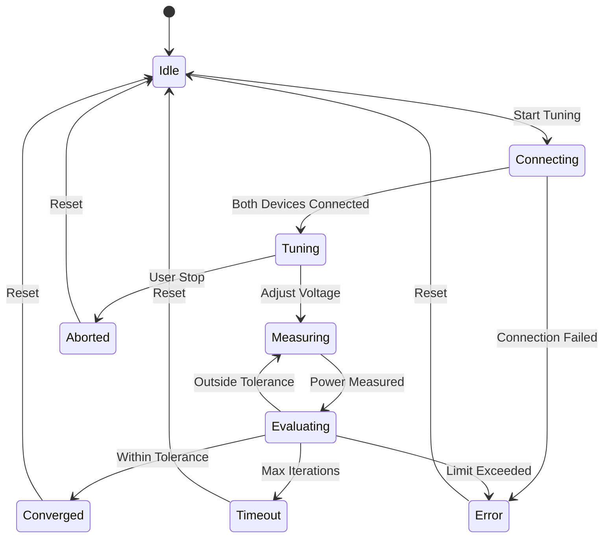

# Design Document: Calibration Tuning Application

## Overview

The Calibration Tuning Application is a WinForms GUI application that integrates two existing device libraries (Tegam 1830A Power Meter and Siglent SDG6052X Signal Generator) to perform automated power calibration through iterative voltage adjustment. The application implements a feedback control loop that measures RF power and adjusts signal generator voltage until a target power setpoint is achieved within a specified tolerance.

### Key Design Goals

1. **Integration Architecture**: Coordinate two independent device libraries through a unified tuning controller
2. **Feedback Control**: Implement a simple proportional control algorithm for voltage adjustment
3. **Safety and Limits**: Enforce voltage and power limits to prevent equipment damage
4. **Real-time Monitoring**: Provide live feedback on tuning progress through UI updates and visualization
5. **Data Persistence**: Log all measurements and configuration for calibration records
6. **Separation of Concerns**: Maintain clear boundaries between device control, tuning logic, UI, and data logging

### Technology Stack

- **Framework**: .NET Framework 4.8 (WinForms)
- **Device Libraries**: 
  - Tegam.1830A.DeviceLibrary (.NET 4.0) - Power meter control
  - Siglent.SDG6052X.DeviceLibrary (.NET 4.0) - Signal generator control
- **Dependency Injection**: Microsoft.Extensions.DependencyInjection
- **Charting**: System.Windows.Forms.DataVisualization.Charting
- **Configuration**: System.Configuration (app.config and user settings)
- **Testing**: NUnit 3.13.3, FsCheck 2.16.5

## Architecture

### High-Level Architecture

```
┌─────────────────────────────────────────────────────────────┐
│                    WinForms UI Layer                        │
│  ┌──────────────┐  ┌──────────────┐  ┌──────────────┐     │
│  │  MainForm    │  │ Tuning Panel │  │ Chart Control│     │
│  └──────────────┘  └──────────────┘  └──────────────┘     │
└────────────┬────────────────┬────────────────┬─────────────┘
             │                │                │
             │ Events         │ Commands       │ Data Binding
             │                │                │
┌────────────▼────────────────▼────────────────▼─────────────┐
│                   Controller Layer                          │
│  ┌──────────────────────────────────────────────────────┐  │
│  │         TuningController (Orchestrator)              │  │
│  │  - Coordinates devices                               │  │
│  │  - Implements tuning algorithm                       │  │
│  │  - Manages tuning state machine                      │  │
│  └──────────────────────────────────────────────────────┘  │
│  ┌──────────────────┐  ┌──────────────────────────────┐   │
│  │ DataLoggingCtrl  │  │ ConfigurationController      │   │
│  └──────────────────┘  └──────────────────────────────┘   │
└────────────┬────────────────────────┬─────────────────────┘
             │                        │
             │ Service Calls          │ Service Calls
             │                        │
┌────────────▼────────────────────────▼─────────────────────┐
│                   Service Layer                            │
│  ┌──────────────────────┐  ┌──────────────────────────┐   │
│  │ IPowerMeterService   │  │ ISignalGeneratorService  │   │
│  │ (Tegam Library)      │  │ (Siglent Library)        │   │
│  └──────────────────────┘  └──────────────────────────┘   │
└────────────┬────────────────────────┬─────────────────────┘
             │                        │
             │ SCPI/VISA              │ SCPI/VISA
             │                        │
┌────────────▼────────────────────────▼─────────────────────┐
│                   Hardware Layer                           │
│  ┌──────────────────────┐  ┌──────────────────────────┐   │
│  │  Tegam 1830A         │  │  Siglent SDG6052X        │   │
│  │  Power Meter         │  │  Signal Generator        │   │
│  └──────────────────────┘  └──────────────────────────┘   │
└────────────────────────────────────────────────────────────┘
```

### Component Responsibilities

**UI Layer**:
- MainForm: Application window, tab management, menu bar
- TuningPanel: User controls for tuning parameters and start/stop
- ConnectionPanel: Device connection controls and status
- ChartControl: Real-time visualization of power vs iteration
- StatusPanel: Display of current tuning state and measurements

**Controller Layer**:
- TuningController: Orchestrates tuning process, implements control algorithm
- DataLoggingController: Manages CSV file writing
- ConfigurationController: Handles settings persistence

**Service Layer** (Existing Libraries):
- IPowerMeterService: Power measurement operations
- ISignalGeneratorService: Signal generation and voltage control

### Tuning State Machine



**States**:
- **Idle**: No tuning active, devices may or may not be connected
- **Connecting**: Establishing connections to both devices
- **Tuning**: Active tuning loop running
- **Measuring**: Waiting for power measurement from power meter
- **Evaluating**: Comparing measurement to setpoint, deciding next action
- **Converged**: Target power achieved within tolerance
- **Timeout**: Maximum iterations reached without convergence
- **Error**: Safety limit exceeded or device error
- **Aborted**: User manually stopped tuning

## Components and Interfaces

### TuningController

Primary orchestrator for the tuning process.

```csharp
public interface ITuningController
{
    // Events
    event EventHandler<TuningStateChangedEventArgs> StateChanged;
    event EventHandler<TuningProgressEventArgs> ProgressUpdated;
    event EventHandler<TuningCompletedEventArgs> TuningCompleted;
    event EventHandler<ErrorEventArgs> ErrorOccurred;
    
    // Properties
    TuningState CurrentState { get; }
    TuningParameters Parameters { get; }
    TuningStatistics Statistics { get; }
    
    // Methods
    Task<bool> ConnectDevicesAsync(string powerMeterIp, string signalGenIp);
    void DisconnectDevices();
    Task StartTuningAsync(TuningParameters parameters);
    void StopTuning();
    Task<PowerMeasurement> MeasureManualAsync();
}
```

**Key Responsibilities**:
- Coordinate both device services
- Execute tuning algorithm
- Enforce safety limits
- Emit events for UI updates
- Manage tuning state transitions

### TuningParameters

Configuration for a tuning session.

```csharp
public class TuningParameters
{
    public double FrequencyHz { get; set; }
    public double InitialVoltage { get; set; }
    public double TargetPowerDbm { get; set; }
    public double ToleranceDb { get; set; }
    public double VoltageStepSize { get; set; }
    public double MinVoltage { get; set; }
    public double MaxVoltage { get; set; }
    public int MaxIterations { get; set; }
    public int SensorId { get; set; }
}
```

### TuningStatistics

Real-time statistics during tuning.

```csharp
public class TuningStatistics
{
    public int CurrentIteration { get; set; }
    public double CurrentVoltage { get; set; }
    public double CurrentPowerDbm { get; set; }
    public double PowerError { get; set; } // Measured - Target
    public TimeSpan ElapsedTime { get; set; }
    public List<TuningDataPoint> History { get; set; }
}

public class TuningDataPoint
{
    public int Iteration { get; set; }
    public DateTime Timestamp { get; set; }
    public double Voltage { get; set; }
    public double PowerDbm { get; set; }
}
```

### DataLoggingController

Manages CSV file writing for tuning sessions.

```csharp
public interface IDataLoggingController
{
    event EventHandler<int> MeasurementLogged;
    event EventHandler<string> OperationError;
    
    bool IsLogging { get; }
    string CurrentLogFile { get; }
    
    void StartLogging(string filePath);
    void StopLogging();
    void LogMeasurement(TuningDataPoint dataPoint, string status);
    void LogSessionStart(TuningParameters parameters);
    void LogSessionEnd(TuningResult result);
}
```

**CSV Format**:
```csv
Timestamp,Iteration,Frequency_Hz,Voltage,Power_dBm,Status
2026-03-22 10:30:15.123,1,2400000000,0.5,-20.5,Tuning
2026-03-22 10:30:16.456,2,2400000000,0.55,-18.3,Tuning
2026-03-22 10:30:17.789,3,2400000000,0.6,-16.1,Converged
```

### ConfigurationController

Handles application settings persistence.

```csharp
public interface IConfigurationController
{
    TuningParameters LoadLastParameters();
    void SaveParameters(TuningParameters parameters);
    
    DeviceConfiguration LoadDeviceConfiguration();
    void SaveDeviceConfiguration(DeviceConfiguration config);
    
    string LoadLastLogPath();
    void SaveLastLogPath(string path);
}

public class DeviceConfiguration
{
    public string PowerMeterIpAddress { get; set; }
    public string SignalGeneratorIpAddress { get; set; }
}
```

**Storage Location**: `%AppData%\CalibrationTuning\settings.json`

## Data Models

### TuningState Enumeration

```csharp
public enum TuningState
{
    Idle,
    Connecting,
    Tuning,
    Measuring,
    Evaluating,
    Converged,
    Timeout,
    Error,
    Aborted
}
```

### TuningResult

Final result of a tuning session.

```csharp
public class TuningResult
{
    public TuningState FinalState { get; set; }
    public int TotalIterations { get; set; }
    public double FinalVoltage { get; set; }
    public double FinalPowerDbm { get; set; }
    public double PowerError { get; set; }
    public TimeSpan Duration { get; set; }
    public string ErrorMessage { get; set; }
}
```

### Event Arguments

```csharp
public class TuningStateChangedEventArgs : EventArgs
{
    public TuningState PreviousState { get; set; }
    public TuningState NewState { get; set; }
}

public class TuningProgressEventArgs : EventArgs
{
    public TuningStatistics Statistics { get; set; }
}

public class TuningCompletedEventArgs : EventArgs
{
    public TuningResult Result { get; set; }
}
```

## Tuning Algorithm

### Control Strategy

The application implements a **simple proportional control** algorithm:

1. **Measure Current Power**: Read power from Tegam 1830A
2. **Calculate Error**: `error = measured_power - target_power`
3. **Determine Direction**:
   - If `error < -tolerance`: Power too low → Increase voltage
   - If `error > +tolerance`: Power too high → Decrease voltage
   - If `|error| <= tolerance`: Converged → Stop
4. **Adjust Voltage**: `new_voltage = current_voltage ± voltage_step`
5. **Check Limits**: Verify voltage within [min_voltage, max_voltage]
6. **Repeat**: Continue until converged, timeout, or error

### Algorithm Pseudocode

```
function TuneToSetpoint(parameters):
    voltage = parameters.InitialVoltage
    iteration = 0
    
    // Configure devices
    SetSignalFrequency(parameters.FrequencyHz)
    SetPowerMeterFrequency(parameters.FrequencyHz)
    SetPowerMeterSensor(parameters.SensorId)
    SetSignalVoltage(voltage)
    EnableSignalOutput()
    
    while iteration < parameters.MaxIterations:
        iteration++
        
        // Measure current power
        measured_power = MeasurePower()
        error = measured_power - parameters.TargetPowerDbm
        
        // Log data point
        LogMeasurement(iteration, voltage, measured_power)
        
        // Check convergence
        if abs(error) <= parameters.ToleranceDb:
            return Converged
        
        // Adjust voltage
        if error < -parameters.ToleranceDb:
            // Power too low, increase voltage
            voltage = voltage + parameters.VoltageStepSize
        else:
            // Power too high, decrease voltage
            voltage = voltage - parameters.VoltageStepSize
        
        // Check safety limits
        if voltage > parameters.MaxVoltage:
            DisableSignalOutput()
            return Error("Max voltage exceeded")
        if voltage < parameters.MinVoltage:
            DisableSignalOutput()
            return Error("Min voltage exceeded")
        
        // Apply new voltage
        SetSignalVoltage(voltage)
        
        // Small delay for settling
        Wait(100ms)
    
    // Max iterations reached
    DisableSignalOutput()
    return Timeout
```

### Convergence Criteria

Tuning is considered successful when:
```
|measured_power - target_power| <= tolerance
```

For example, with `target = -10 dBm` and `tolerance = 0.5 dB`:
- Converged if measured power is between -10.5 dBm and -9.5 dBm

### Safety Mechanisms

1. **Voltage Limits**: Hard limits on min/max voltage prevent equipment damage
2. **Iteration Limit**: Prevents infinite loops if convergence is not possible
3. **Overload Detection**: Monitor power meter for overload condition
4. **Error Handling**: Any device communication error immediately stops tuning
5. **Manual Abort**: User can stop tuning at any time

