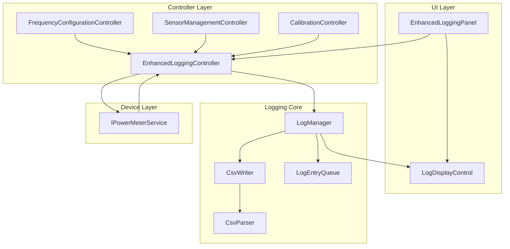

# Design Document: Enhanced Logging System

## Overview

The Enhanced Logging System extends the existing Tegam 1830A data logging capabilities to create a unified audit trail that captures both power measurement data and configuration changes. The system maintains backward compatibility with the existing DataLoggingController while adding new functionality for settings tracking, on-screen display, and automatic sampling.

The design introduces a new CSV format with a "Type" column that distinguishes between data measurements and settings changes. This unified format enables test engineers to correlate measurement results with the configuration context in which they were captured, providing complete traceability for test sessions.

Key capabilities:
- Unified CSV logging with Type column (Data/Setting)
- Automatic capture of all configuration changes
- Manual and automatic sampling modes
- Real-time on-screen log display
- Thread-safe concurrent access
- CSV parsing and validation
- Backward compatibility mode

## Architecture

### System Components



### Component Responsibilities

**EnhancedLoggingController**
- Extends DataLoggingController functionality
- Coordinates logging operations
- Manages automatic sampling timer
- Subscribes to configuration change events from other controllers
- Maintains backward compatibility

**LogManager**
- Central logging coordinator
- Manages log entry queue
- Handles file operations via CsvWriter
- Implements retry logic for failed writes
- Manages flush strategy (10 entries or 5 seconds)
- Thread-safe access to shared resources

**CsvWriter**
- Writes log entries to CSV files
- Handles CSV escaping per RFC 4180
- Manages file handles and buffering
- Implements atomic write operations

**CsvParser**
- Parses CSV files into LogEntry objects
- Validates format and data types
- Provides detailed error messages with line numbers

**LogDisplayControl**
- Custom UserControl for displaying log entries
- Shows most recent 100 entries
- Color-coded by entry type
- Auto-scrolls to newest entries

**LogEntryQueue**
- Thread-safe queue for pending log entries
- Handles queuing when logging is inactive
- Supports batch dequeue operations

## Components and Interfaces

### Core Interfaces

```csharp
public interface ILogManager
{
    void StartLogging(string filename);
    void StopLogging();
    void LogEntry(LogEntry entry);
    LoggingState CurrentState { get; }
    int TotalEntryCount { get; }
    string CurrentLogFile { get; }
    
    event EventHandler<LogEntry> EntryLogged;
    event EventHandler<LoggingStateChangedEventArgs> StateChanged;
    event EventHandler<string> WriteError;
}

public interface ICsvWriter
{
    void WriteHeader();
    void WriteEntry(LogEntry entry);
    void Flush();
    void Close();
}

public interface ICsvParser
{
    ParseResult<List<LogEntry>> Parse(string filename);
    ParseResult<List<LogEntry>> ParseLines(IEnumerable<string> lines);
}

public interface ILogDisplayControl
{
    void AddEntry(LogEntry entry);
    void Clear();
    void SetMaxEntries(int maxEntries);
}
```

### Event Subscription Pattern

The EnhancedLoggingController subscribes to configuration change events from other controllers:

```csharp
// In EnhancedLoggingController constructor
_frequencyController.FrequencySet += OnFrequencySet;
_sensorController.SensorSelected += OnSensorSelected;
_calibrationController.CalibrationStarted += OnCalibrationStarted;
_powerMeterService.ConnectionStateChanged += OnConnectionStateChanged;
```

When these events fire, the controller creates appropriate SettingEntry objects and logs them via LogManager.

## Data Models

### LogEntry Hierarchy

```csharp
public abstract class LogEntry
{
    public DateTime Timestamp { get; set; }
    public abstract string Type { get; }
    public abstract string ToCsvLine();
    public abstract string ToDisplayString();
    
    protected LogEntry()
    {
        Timestamp = DateTime.Now;
    }
}

public class DataEntry : LogEntry
{
    public override string Type => "Data";
    public double Frequency { get; set; }
    public FrequencyUnit FrequencyUnit { get; set; }
    public double Power { get; set; }
    public PowerUnit PowerUnit { get; set; }
    public int SensorId { get; set; }
    
    public override string ToCsvLine()
    {
        return $"Data,{Timestamp:yyyy-MM-dd HH:mm:ss.fff}," +
               $"{Frequency},{Power:F2},{SensorId}";
    }
    
    public override string ToDisplayString()
    {
        return $"Power: {Power:F2} dBm @ {Frequency} Hz";
    }
}

public class SettingEntry : LogEntry
{
    public override string Type => "Setting";
    public string SettingName { get; set; }
    public string SettingValue { get; set; }
    public string Context { get; set; }
    
    public override string ToCsvLine()
    {
        return $"Setting,{Timestamp:yyyy-MM-dd HH:mm:ss.fff}," +
               $"{EscapeCsv(SettingName)},{EscapeCsv(SettingValue)},{EscapeCsv(Context)}";
    }
    
    public override string ToDisplayString()
    {
        return $"{SettingName}: {SettingValue}";
    }
    
    private string EscapeCsv(string value)
    {
        if (string.IsNullOrEmpty(value)) return "";
        if (value.Contains(",") || value.Contains("\"") || value.Contains("\n"))
        {
            return "\"" + value.Replace("\"", "\"\"") + "\"";
        }
        return value;
    }
}
```

### Supporting Models

```csharp
public enum LoggingState
{
    NotStarted,
    Active,
    Stopped
}

public class LoggingStateChangedEventArgs : EventArgs
{
    public LoggingState OldState { get; set; }
    public LoggingState NewState { get; set; }
    public string Filename { get; set; }
}

public class ParseResult<T>
{
    public bool IsSuccess { get; set; }
    public T Value { get; set; }
    public string ErrorMessage { get; set; }
    public int? ErrorLine { get; set; }
    
    public static ParseResult<T> Success(T value)
    {
        return new ParseResult<T> { IsSuccess = true, Value = value };
    }
    
    public static ParseResult<T> Failure(string error, int? line = null)
    {
        return new ParseResult<T> 
        { 
            IsSuccess = false, 
            ErrorMessage = error, 
            ErrorLine = line 
        };
    }
}

public class AutoSamplingConfig
{
    public int SampleRateMs { get; set; }
    public int SampleCount { get; set; }
    public bool IsActive { get; set; }
    public int CompletedCount { get; set; }
}
```

## CSV Format Specification

### File Structure

```
Type,Timestamp,Column3,Column4,Column5
Data,2024-01-15 10:30:45.123,50000000,15.42,1
Setting,2024-01-15 10:30:50.456,Frequency,"50 MHz",User set via UI
Data,2024-01-15 10:30:55.789,50000000,15.38,1
Setting,2024-01-15 10:31:00.012,Sensor_ID,2,Switched from sensor 1
```

### Column Definitions

**For Data Entries:**
- Column 1: Type = "Data"
- Column 2: Timestamp (yyyy-MM-dd HH:mm:ss.fff)
- Column 3: Frequency (Hz)
- Column 4: Power (dBm, 2 decimal places)
- Column 5: Sensor ID

**For Setting Entries:**
- Column 1: Type = "Setting"
- Column 2: Timestamp (yyyy-MM-dd HH:mm:ss.fff)
- Column 3: Setting Name
- Column 4: Setting Value
- Column 5: Context

### CSV Escaping Rules (RFC 4180)

1. Fields containing commas, quotes, or newlines must be enclosed in double quotes
2. Double quotes within fields must be escaped by doubling them ("")
3. Leading and trailing whitespace is preserved within quoted fields

Examples:
- `Hello, World` → `"Hello, World"`
- `He said "Hi"` → `"He said ""Hi"""`
- `Normal text` → `Normal text`

## UI Design

### EnhancedLoggingPanel Layout

```
┌─────────────────────────────────────────────────────────────┐
│ Enhanced Logging Control                                     │
├─────────────────────────────────────────────────────────────┤
│ File: [________________________] [Browse]                    │
│                                                              │
│ Status: ● Logging Active        Entries: 42                 │
│ File: C:\logs\test_session_001.csv                          │
│                                                              │
│ [Start Logging]  [Stop Logging]                             │
│                                                              │
│ ┌─ Manual Sampling ────────────────────────────────────┐    │
│ │ [Measure Now]                                        │    │
│ └──────────────────────────────────────────────────────┘    │
│                                                              │
│ ┌─ Automatic Sampling ─────────────────────────────────┐    │
│ │ Sample Rate: [1000] ms    Count: [100]              │    │
│ │ [Start Auto]  [Stop Auto]   Progress: 45/100        │    │
│ └──────────────────────────────────────────────────────┘    │
│                                                              │
│ ┌─ Recent Log Entries ─────────────────────────────────┐    │
│ │ Type     Time         Details                        │    │
│ │ ──────────────────────────────────────────────────── │    │
│ │ Data     10:30:45.123 Power: 15.42 dBm @ 50 MHz     │    │
│ │ Setting  10:30:50.456 Frequency: 50 MHz              │    │
│ │ Data     10:30:55.789 Power: 15.38 dBm @ 50 MHz     │    │
│ │ Setting  10:31:00.012 Sensor_ID: 2                   │    │
│ │ ...                                                   │    │
│ └──────────────────────────────────────────────────────┘    │
└─────────────────────────────────────────────────────────────┘
```

### LogDisplayControl Implementation

- Uses ListView in Details mode with 3 columns
- Data entries displayed in blue (Color.Blue)
- Setting entries displayed in green (Color.DarkGreen)
- Maintains circular buffer of 100 entries
- Auto-scrolls to bottom on new entry
- Thread-safe updates via Control.Invoke

## Threading and Concurrency

### Thread Safety Strategy

**File Access:**
- Single writer thread via LogManager
- Lock-based synchronization using `_fileLock` object
- All file operations wrapped in lock statements

**Log Entry Queue:**
- Thread-safe ConcurrentQueue<LogEntry>
- Multiple producers (UI thread, timer thread, event handlers)
- Single consumer (LogManager background thread)

**UI Updates:**
- All UI updates marshaled to UI thread via Control.Invoke
- LogDisplayControl checks InvokeRequired before updates

### Automatic Sampling Timer

```csharp
private System.Threading.Timer _autoSamplingTimer;

private void StartAutomaticSampling(int rateMs, int count)
{
    _autoSamplingConfig = new AutoSamplingConfig
    {
        SampleRateMs = rateMs,
        SampleCount = count,
        IsActive = true,
        CompletedCount = 0
    };
    
    LogSettingChange("Auto_Sampling", 
        $"Started: rate={rateMs}ms, count={count}", 
        "User initiated");
    
    _autoSamplingTimer = new System.Threading.Timer(
        AutoSamplingCallback,
        null,
        0,  // Start immediately
        rateMs);
}

private void AutoSamplingCallback(object state)
{
    if (!_autoSamplingConfig.IsActive) return;
    
    // Trigger measurement
    var measurement = _powerMeterService.MeasurePower();
    LogDataMeasurement(measurement);
    
    _autoSamplingConfig.CompletedCount++;
    
    if (_autoSamplingConfig.CompletedCount >= _autoSamplingConfig.SampleCount)
    {
        StopAutomaticSampling();
    }
}
```

### Flush Strategy

LogManager implements a dual-trigger flush:

```csharp
private int _entriesSinceFlush = 0;
private DateTime _lastFlushTime = DateTime.Now;

private void CheckFlush()
{
    bool shouldFlush = _entriesSinceFlush >= 10 || 
                       (DateTime.Now - _lastFlushTime).TotalSeconds >= 5;
    
    if (shouldFlush)
    {
        _csvWriter.Flush();
        _entriesSinceFlush = 0;
        _lastFlushTime = DateTime.Now;
    }
}
```

## Error Handling

### Write Retry Logic

```csharp
private bool WriteEntryWithRetry(LogEntry entry, int maxRetries = 3)
{
    for (int attempt = 1; attempt <= maxRetries; attempt++)
    {
        try
        {
            lock (_fileLock)
            {
                _csvWriter.WriteEntry(entry);
                return true;
            }
        }
        catch (IOException ex)
        {
            if (attempt == maxRetries)
            {
                WriteError?.Invoke(this, 
                    $"Failed to write entry after {maxRetries} attempts: {ex.Message}");
                return false;
            }
            System.Threading.Thread.Sleep(100);
        }
    }
    return false;
}
```

### Error Event Handling

The system raises events for errors rather than throwing exceptions:

- `WriteError`: Raised when file write fails after all retries
- `OperationError`: Raised for general operation failures
- `ParseError`: Raised when CSV parsing fails

This allows the UI to remain responsive and display error messages without crashing.

### Graceful Degradation

When logging fails:
1. Error event is raised with details
2. Entry is discarded (not queued indefinitely)
3. System continues operation
4. UI displays error message
5. User can attempt to stop/restart logging

## Testing Strategy

The Enhanced Logging System will be validated using a dual testing approach combining unit tests for specific scenarios and property-based tests for comprehensive coverage.

### Unit Testing Approach

Unit tests will focus on:
- Specific examples of CSV escaping (commas, quotes, newlines)
- Edge cases (empty files, single entry, maximum entries)
- Error conditions (file access denied, disk full, invalid paths)
- Integration points between components
- UI behavior (button states, display updates)
- Timer behavior (start, stop, completion)

### Property-Based Testing Approach

Property-based tests will use FsCheck (already in the project) to verify universal properties across randomly generated inputs. Each property test will run a minimum of 100 iterations.

The property-based testing library FsCheck is already available in the project (packages/FsCheck.2.16.5 and packages/FsCheck.NUnit.2.16.5).

Configuration:
- Minimum 100 iterations per property test
- Each test tagged with: `Feature: enhanced-logging-system, Property {N}: {description}`
- Tests organized in separate PropertyTests.cs files

## Correctness Properties

*A property is a characteristic or behavior that should hold true across all valid executions of a system—essentially, a formal statement about what the system should do. Properties serve as the bridge between human-readable specifications and machine-verifiable correctness guarantees.*

### Property 1: CSV Round-Trip Preservation

*For any* collection of valid LogEntry objects (DataEntry and SettingEntry), writing them to CSV format then parsing the CSV back SHALL produce equivalent LogEntry objects with all fields preserved.

**Validates: Requirements 1.7, 8.7**

This is the fundamental correctness property for CSV serialization. It ensures that CSV escaping (commas, quotes, newlines) works correctly and that no data is lost or corrupted during the write-parse cycle. This property subsumes individual tests for CSV escaping and format validation.

### Property 2: Type Column Validity

*For any* CSV file written by the CSV_Writer, all entries SHALL have a Type column as the first column with values of either "Data" or "Setting".

**Validates: Requirements 1.1, 1.2**

### Property 3: DataEntry Structure Completeness

*For any* DataEntry object, when written to CSV and parsed back, the result SHALL contain all required fields: Type="Data", Timestamp, Frequency, Power, and SensorId.

**Validates: Requirements 1.3, 3.2**

### Property 4: SettingEntry Structure Completeness

*For any* SettingEntry object, when written to CSV and parsed back, the result SHALL contain all required fields: Type="Setting", Timestamp, SettingName, SettingValue, and Context.

**Validates: Requirements 1.4**

### Property 5: Timestamp Format Preservation

*For any* LogEntry with a Timestamp, when written to CSV and parsed back, the Timestamp SHALL be preserved with millisecond precision in the format "yyyy-MM-dd HH:mm:ss.fff".

**Validates: Requirements 1.6**

### Property 6: Power Value Precision

*For any* DataEntry with a Power value, when written to CSV, the Power value SHALL be formatted to exactly 2 decimal places.

**Validates: Requirements 3.5**

### Property 7: Chronological Ordering

*For any* sequence of LogEntry objects with different timestamps, when written to CSV, the entries SHALL appear in chronological order based on their Timestamp values.

**Validates: Requirements 3.7**

### Property 8: Settings Queuing When Inactive

*For any* sequence of SettingEntry objects logged while logging is inactive, when logging is subsequently started, all queued entries SHALL be written to the CSV file in the order they were logged.

**Validates: Requirements 2.7**

### Property 9: Data Entry Type Consistency

*For any* power measurement received, the logged entry SHALL have Type="Data".

**Validates: Requirements 3.1**

### Property 10: Thread-Safe Concurrent Writes

*For any* set of LogEntry objects written concurrently from multiple threads, the resulting CSV file SHALL contain all entries without corruption, with each entry on a complete line.

**Validates: Requirements 7.3**

### Property 11: Display Format for DataEntry

*For any* DataEntry displayed in the Log_Display, the Details column SHALL contain the power value, unit, frequency, and unit in the format "Power: {value} dBm @ {frequency} Hz".

**Validates: Requirements 6.3**

### Property 12: Display Format for SettingEntry

*For any* SettingEntry displayed in the Log_Display, the Details column SHALL contain the setting name and value in the format "{SettingName}: {SettingValue}".

**Validates: Requirements 6.4**

### Property 13: Display Timestamp Format

*For any* LogEntry displayed in the Log_Display, the Timestamp SHALL be formatted as "HH:mm:ss.fff" (time only, with milliseconds).

**Validates: Requirements 6.8**

### Property 14: Entry Count Accuracy

*For any* sequence of logged entries (both DataEntry and SettingEntry), the total entry count displayed SHALL equal the actual number of entries written to the CSV file.

**Validates: Requirements 9.5**

### Property 15: Logging State Transitions

*For any* sequence of logging operations (start, stop), the logging state SHALL transition correctly: NotStarted → Active (on start) → Stopped (on stop), and SHALL never enter an invalid state.

**Validates: Requirements 9.1**

### Property 16: Valid CSV Parser Output

*For any* valid CSV file conforming to the enhanced format, the CSV_Parser SHALL successfully parse it and return a collection of LogEntry objects without errors.

**Validates: Requirements 8.2**

### Property Reflection Notes

During property analysis, several redundancies were identified and resolved:

- **Requirements 3.2 and 1.3** both specify DataEntry structure - combined into Property 3
- **Requirements 8.8 and 1.7** both test CSV escaping - combined into Property 1 (round-trip)
- **Requirements 3.3 and 4.1** both test manual sampling - handled by unit tests, not properties
- **Requirement 10.7 and 7.3** both address thread safety - combined into Property 10

Properties focus on universal behaviors that hold across all inputs, while unit tests handle specific examples, edge cases (boundary values, empty files), integration scenarios (button clicks, event handling), and timing-dependent behaviors.

