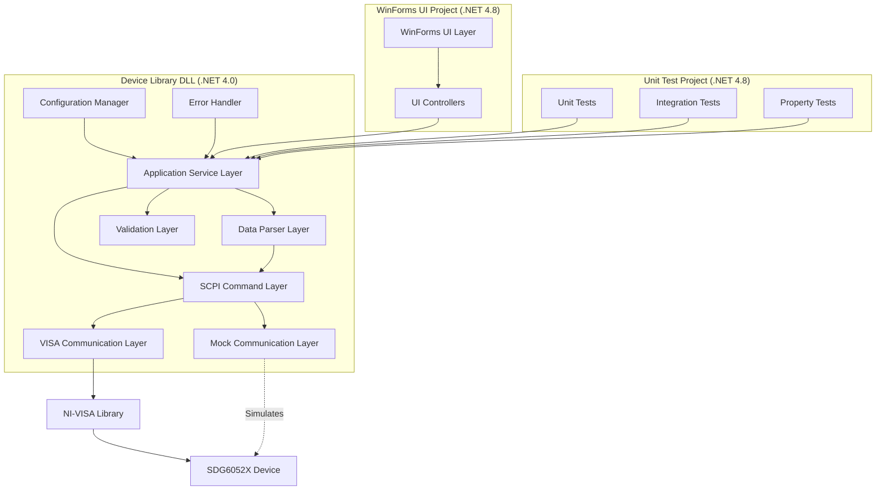
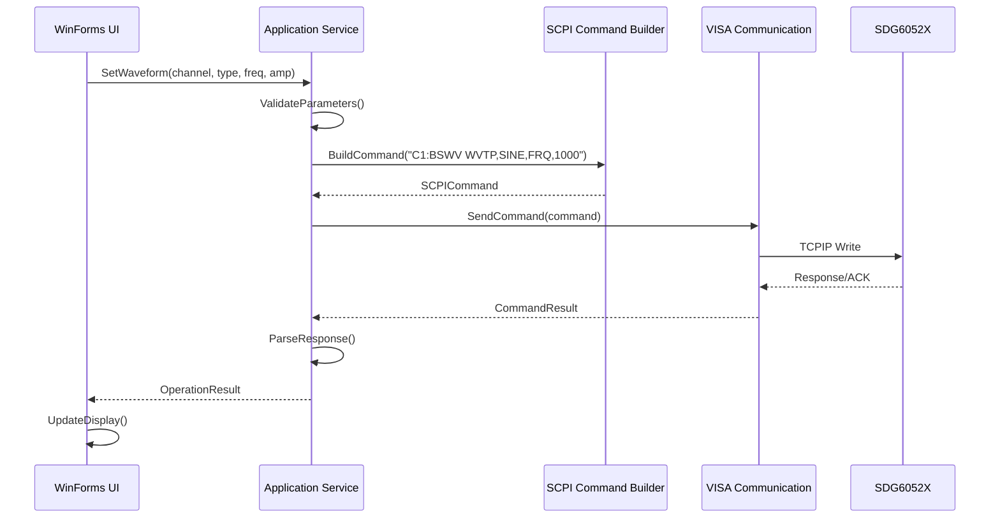

# Design Document: Siglent SDG6052X Control Application

## Overview

The Siglent SDG6052X Control Application is a comprehensive C# .NET solution that provides complete control over the Siglent SDG6052X dual-channel arbitrary waveform generator. The solution is structured as three separate projects: a Device Library DLL (.NET Framework 4.0) containing all core device communication logic, a WinForms UI application (.NET Framework 4.8) that references the device library, and a Unit Test project (.NET Framework 4.8) for comprehensive testing. The device library communicates with the physical device via TCPIP using the NI-VISA library and implements the SCPI (Standard Commands for Programmable Instruments) protocol. The design follows a layered architecture with clear separation between communication, command processing, data parsing, and user interface concerns. A mock communication component enables testing and development without physical hardware. The application supports all SDG6052X features including basic waveform generation, modulation (AM, FM, PM, PWM, FSK, ASK, PSK), sweep operations, burst mode, arbitrary waveform management, and device configuration.

## Architecture

The solution follows a multi-project architecture with clear separation between device logic and UI:



### Project Structure

**1. Siglent.SDG6052X.DeviceLibrary (.NET Framework 4.0)**
- Core device communication classes
- SCPI command builder and response parser
- VISA communication manager (real and mock)
- Data models, validators, and service layer
- Compiled as a DLL for reuse
- No UI dependencies

**2. Siglent.SDG6052X.WinFormsUI (.NET Framework 4.8)**
- WinForms application and forms
- UI controllers and event handlers
- References DeviceLibrary DLL
- Handles user interaction and display

**3. Siglent.SDG6052X.Tests (.NET Framework 4.8)**
- Unit tests for all device library components
- Integration tests using mock communication
- Property-based tests
- References DeviceLibrary DLL


## Main Application Workflow



## Components and Interfaces

### Component 1: VISA Communication Manager

**Purpose**: Manages low-level TCPIP communication with the SDG6052X using NI-VISA library

**Project**: Siglent.SDG6052X.DeviceLibrary

**Interface**:
```csharp
public interface IVisaCommunicationManager : IDisposable
{
    // Connection management
    bool Connect(string resourceName, int timeout = 5000);
    void Disconnect();
    bool IsConnected { get; }
    
    // Command execution
    CommandResult SendCommand(string command);
    string Query(string query);
    byte[] QueryBinary(string query);
    
    // Async operations
    Task<CommandResult> SendCommandAsync(string command);
    Task<string> QueryAsync(string query);
    
    // Device identification
    string GetDeviceIdentity();
    
    // Error handling
    event EventHandler<CommunicationErrorEventArgs> CommunicationError;
}
```

**Responsibilities**:
- Establish and maintain TCPIP connection via NI-VISA
- Send SCPI commands and receive responses
- Handle communication timeouts and errors
- Manage resource cleanup

**Implementations**:
- `VisaCommunicationManager`: Real hardware communication using NI-VISA
- `MockVisaCommunicationManager`: Simulated communication for testing

### Component 1a: Mock VISA Communication Manager

**Purpose**: Simulates SCPI communication with SDG6052X for testing without physical hardware

**Project**: Siglent.SDG6052X.DeviceLibrary

**Interface**: Implements `IVisaCommunicationManager`

**Implementation Details**:
```csharp
public class MockVisaCommunicationManager : IVisaCommunicationManager
{
    private Dictionary<int, SimulatedChannelState> _channelStates;
    private SimulatedDeviceState _deviceState;
    private bool _isConnected;
    private Queue<DeviceError> _errorQueue;
    
    // Simulates device state and returns realistic responses
    public string Query(string query)
    {
        if (!_isConnected)
            throw new InvalidOperationException("Not connected");
        
        return ProcessQuery(query);
    }
    
    public CommandResult SendCommand(string command)
    {
        if (!_isConnected)
            return CommandResult.Failed("Not connected");
        
        return ProcessCommand(command);
    }
    
    // Internal simulation logic
    private string ProcessQuery(string query)
    {
        // Parse query and return simulated response
        // Examples:
        // "*IDN?" -> "Siglent Technologies,SDG6052X,SDG00000000001,1.01.01.32"
        // "C1:BSWV?" -> "C1:BSWV WVTP,SINE,FRQ,1000HZ,AMP,5VPP,OFST,0V,PHSE,0"
        // "SYST:ERR?" -> "0,No Error" or error from queue
    }
    
    private CommandResult ProcessCommand(string command)
    {
        // Parse command and update simulated state
        // Validate parameters and return success/error
    }
}
```

**Responsibilities**:
- Simulate SCPI command processing
- Maintain simulated device state (waveforms, modulation, sweep, burst)
- Generate realistic SCPI responses
- Simulate device errors and edge cases
- Enable testing without physical hardware

**Simulated State**:
- Channel states (waveform type, frequency, amplitude, offset, phase)
- Output enable states
- Load impedance settings
- Modulation configurations
- Sweep configurations
- Burst configurations
- Arbitrary waveform storage
- Error queue

### Component 2: SCPI Command Builder

**Purpose**: Constructs valid SCPI commands from application-level parameters

**Project**: Siglent.SDG6052X.DeviceLibrary

**Interface**:
```csharp
public interface IScpiCommandBuilder
{
    // Basic waveform commands
    string BuildBasicWaveCommand(int channel, WaveformType type, WaveformParameters parameters);
    string BuildOutputStateCommand(int channel, bool enabled);
    string BuildLoadCommand(int channel, LoadImpedance load);
    
    // Modulation commands
    string BuildModulationCommand(int channel, ModulationType type, ModulationParameters parameters);
    string BuildModulationStateCommand(int channel, bool enabled);
    
    // Sweep commands
    string BuildSweepCommand(int channel, SweepParameters parameters);
    string BuildSweepStateCommand(int channel, bool enabled);
    
    // Burst commands
    string BuildBurstCommand(int channel, BurstParameters parameters);
    string BuildBurstStateCommand(int channel, bool enabled);
    
    // Arbitrary waveform commands
    string BuildArbitraryWaveCommand(int channel, string waveformName);
    string BuildStoreArbitraryWaveCommand(string name, double[] points);
    
    // Query commands
    string BuildQueryCommand(int channel, QueryType queryType);
    
    // System commands
    string BuildSystemCommand(SystemCommandType type, params object[] parameters);
}
```

**Responsibilities**:
- Generate syntactically correct SCPI commands
- Format numeric values according to SCPI standards
- Handle channel-specific command prefixes
- Validate command structure

### Component 3: SCPI Response Parser

**Purpose**: Parses SCPI responses into strongly-typed application objects

**Project**: Siglent.SDG6052X.DeviceLibrary

**Interface**:
```csharp
public interface IScpiResponseParser
{
    // Parse basic responses
    bool ParseBooleanResponse(string response);
    double ParseNumericResponse(string response);
    string ParseStringResponse(string response);
    
    // Parse complex responses
    WaveformState ParseWaveformState(string response);
    ModulationState ParseModulationState(string response);
    SweepState ParseSweepState(string response);
    BurstState ParseBurstState(string response);
    
    // Parse device info
    DeviceIdentity ParseIdentityResponse(string response);
    SystemStatus ParseSystemStatus(string response);
    
    // Parse arbitrary waveform data
    double[] ParseArbitraryWaveformData(byte[] binaryData);
    
    // Error parsing
    DeviceError ParseErrorResponse(string response);
}
```

**Responsibilities**:
- Extract data from SCPI response strings
- Convert string values to appropriate types
- Handle unit conversions (Hz, V, dBm, etc.)
- Parse error messages

### Component 4: Signal Generator Service

**Purpose**: High-level application service coordinating device operations

**Project**: Siglent.SDG6052X.DeviceLibrary

**Interface**:
```csharp
public interface ISignalGeneratorService
{
    // Connection
    Task<bool> ConnectAsync(string ipAddress);
    Task DisconnectAsync();
    bool IsConnected { get; }
    DeviceIdentity DeviceInfo { get; }
    
    // Basic waveform control
    Task<OperationResult> SetBasicWaveformAsync(int channel, WaveformType type, WaveformParameters parameters);
    Task<WaveformState> GetWaveformStateAsync(int channel);
    Task<OperationResult> SetOutputStateAsync(int channel, bool enabled);
    Task<OperationResult> SetLoadImpedanceAsync(int channel, LoadImpedance load);
    
    // Modulation control
    Task<OperationResult> ConfigureModulationAsync(int channel, ModulationType type, ModulationParameters parameters);
    Task<OperationResult> SetModulationStateAsync(int channel, bool enabled);
    Task<ModulationState> GetModulationStateAsync(int channel);
    
    // Sweep control
    Task<OperationResult> ConfigureSweepAsync(int channel, SweepParameters parameters);
    Task<OperationResult> SetSweepStateAsync(int channel, bool enabled);
    Task<SweepState> GetSweepStateAsync(int channel);
    
    // Burst control
    Task<OperationResult> ConfigureBurstAsync(int channel, BurstParameters parameters);
    Task<OperationResult> SetBurstStateAsync(int channel, bool enabled);
    Task<BurstState> GetBurstStateAsync(int channel);
    
    // Arbitrary waveform management
    Task<OperationResult> UploadArbitraryWaveformAsync(string name, double[] points);
    Task<OperationResult> SelectArbitraryWaveformAsync(int channel, string name);
    Task<List<string>> GetArbitraryWaveformListAsync();
    Task<OperationResult> DeleteArbitraryWaveformAsync(string name);
    
    // System operations
    Task<OperationResult> RecallSetupAsync(int setupNumber);
    Task<OperationResult> SaveSetupAsync(int setupNumber);
    Task<SystemStatus> GetSystemStatusAsync();
    Task<OperationResult> ResetDeviceAsync();
    
    // Events
    event EventHandler<DeviceErrorEventArgs> DeviceError;
    event EventHandler<ConnectionStateChangedEventArgs> ConnectionStateChanged;
}
```

**Responsibilities**:
- Coordinate between UI and lower layers
- Validate user input parameters
- Manage asynchronous operations
- Handle errors and raise events
- Cache device state when appropriate

### Component 5: Input Validator

**Purpose**: Validates user input against SDG6052X specifications

**Project**: Siglent.SDG6052X.DeviceLibrary

**Interface**:
```csharp
public interface IInputValidator
{
    // Waveform parameter validation
    ValidationResult ValidateFrequency(double frequency, WaveformType type);
    ValidationResult ValidateAmplitude(double amplitude, LoadImpedance load);
    ValidationResult ValidateOffset(double offset, double amplitude, LoadImpedance load);
    ValidationResult ValidatePhase(double phase);
    ValidationResult ValidateDutyCycle(double dutyCycle);
    
    // Modulation parameter validation
    ValidationResult ValidateModulationDepth(double depth, ModulationType type);
    ValidationResult ValidateModulationFrequency(double frequency, ModulationType type);
    ValidationResult ValidateDeviation(double deviation, ModulationType type);
    
    // Sweep parameter validation
    ValidationResult ValidateSweepRange(double startFreq, double stopFreq);
    ValidationResult ValidateSweepTime(double time);
    
    // Burst parameter validation
    ValidationResult ValidateBurstCycles(int cycles);
    ValidationResult ValidateBurstPeriod(double period);
    
    // Arbitrary waveform validation
    ValidationResult ValidateArbitraryWaveformPoints(double[] points);
    ValidationResult ValidateWaveformName(string name);
}
```

**Responsibilities**:
- Enforce device specification limits
- Provide user-friendly validation messages
- Check parameter interdependencies
- Prevent invalid configurations


## Data Models

### Model 1: WaveformParameters

```csharp
public class WaveformParameters
{
    public double Frequency { get; set; }        // Hz (1 µHz to 500 MHz)
    public double Amplitude { get; set; }        // Vpp or dBm
    public double Offset { get; set; }           // V DC
    public double Phase { get; set; }            // Degrees (0-360)
    public double DutyCycle { get; set; }        // Percent (for square/pulse)
    public double Width { get; set; }            // Seconds (for pulse)
    public double Rise { get; set; }             // Seconds (for pulse)
    public double Fall { get; set; }             // Seconds (for pulse)
    public double Delay { get; set; }            // Seconds
    public AmplitudeUnit Unit { get; set; }      // Vpp, Vrms, dBm
}

public enum WaveformType
{
    Sine,
    Square,
    Ramp,
    Pulse,
    Noise,
    Arbitrary,
    DC,
    PRBS,
    IQ
}

public enum AmplitudeUnit
{
    Vpp,
    Vrms,
    dBm
}
```

**Validation Rules**:
- Frequency: 1 µHz ≤ freq ≤ 500 MHz (depends on waveform type)
- Amplitude: 1 mVpp ≤ amp ≤ 20 Vpp (50Ω load) or 2 mVpp ≤ amp ≤ 40 Vpp (High-Z load)
- Offset: -10 V ≤ offset ≤ +10 V (50Ω) or -20 V ≤ offset ≤ +20 V (High-Z)
- Phase: 0° ≤ phase ≤ 360°
- DutyCycle: 0.01% ≤ duty ≤ 99.99%

### Model 2: ModulationParameters

```csharp
public class ModulationParameters
{
    public ModulationType Type { get; set; }
    public ModulationSource Source { get; set; }
    public double Depth { get; set; }            // Percent (AM, PWM)
    public double Deviation { get; set; }        // Hz (FM, PM)
    public double Rate { get; set; }             // Hz (modulation frequency)
    public WaveformType ModulationWaveform { get; set; }
    public double HopFrequency { get; set; }     // Hz (FSK)
    public double HopAmplitude { get; set; }     // V (ASK)
    public double HopPhase { get; set; }         // Degrees (PSK)
}

public enum ModulationType
{
    AM,      // Amplitude Modulation
    FM,      // Frequency Modulation
    PM,      // Phase Modulation
    PWM,     // Pulse Width Modulation
    FSK,     // Frequency Shift Keying
    ASK,     // Amplitude Shift Keying
    PSK      // Phase Shift Keying
}

public enum ModulationSource
{
    Internal,
    External,
    Channel1,
    Channel2
}
```

**Validation Rules**:
- AM Depth: 0% ≤ depth ≤ 120%
- FM Deviation: Depends on carrier frequency
- Modulation Rate: 1 mHz ≤ rate ≤ 1 MHz
- PWM Depth: 0% ≤ depth ≤ 99%

### Model 3: SweepParameters

```csharp
public class SweepParameters
{
    public double StartFrequency { get; set; }   // Hz
    public double StopFrequency { get; set; }    // Hz
    public double Time { get; set; }             // Seconds
    public SweepType Type { get; set; }
    public SweepDirection Direction { get; set; }
    public TriggerSource TriggerSource { get; set; }
    public double ReturnTime { get; set; }       // Seconds
    public double HoldTime { get; set; }         // Seconds
}

public enum SweepType
{
    Linear,
    Logarithmic
}

public enum SweepDirection
{
    Up,
    Down,
    UpDown
}

public enum TriggerSource
{
    Internal,
    External,
    Manual
}
```

**Validation Rules**:
- StartFrequency < StopFrequency
- Time: 1 ms ≤ time ≤ 500 s
- Frequency range must be within waveform limits

### Model 4: BurstParameters

```csharp
public class BurstParameters
{
    public BurstMode Mode { get; set; }
    public int Cycles { get; set; }              // Number of cycles (1-1000000)
    public double Period { get; set; }           // Seconds
    public TriggerSource TriggerSource { get; set; }
    public TriggerEdge TriggerEdge { get; set; }
    public double StartPhase { get; set; }       // Degrees
    public GatePolarity GatePolarity { get; set; }
}

public enum BurstMode
{
    NCycle,    // N-cycle burst
    Gated      // Gated burst
}

public enum TriggerEdge
{
    Rising,
    Falling
}

public enum GatePolarity
{
    Positive,
    Negative
}
```

**Validation Rules**:
- Cycles: 1 ≤ cycles ≤ 1000000
- Period: Must be greater than burst duration
- StartPhase: 0° ≤ phase ≤ 360°

### Model 5: DeviceIdentity

```csharp
public class DeviceIdentity
{
    public string Manufacturer { get; set; }     // "Siglent Technologies"
    public string Model { get; set; }            // "SDG6052X"
    public string SerialNumber { get; set; }
    public string FirmwareVersion { get; set; }
}
```

### Model 6: OperationResult

```csharp
public class OperationResult
{
    public bool Success { get; set; }
    public string Message { get; set; }
    public DeviceError Error { get; set; }
    public DateTime Timestamp { get; set; }
    
    public static OperationResult Successful(string message = "Operation completed successfully")
    {
        return new OperationResult 
        { 
            Success = true, 
            Message = message,
            Timestamp = DateTime.Now
        };
    }
    
    public static OperationResult Failed(string message, DeviceError error = null)
    {
        return new OperationResult 
        { 
            Success = false, 
            Message = message,
            Error = error,
            Timestamp = DateTime.Now
        };
    }
}
```

### Model 7: CommandResult

```csharp
public class CommandResult
{
    public bool Success { get; set; }
    public string Response { get; set; }
    public byte[] BinaryData { get; set; }
    public Exception Exception { get; set; }
    public int ExecutionTimeMs { get; set; }
}
```

### Model 8: LoadImpedance

```csharp
public class LoadImpedance
{
    public LoadType Type { get; set; }
    public double Value { get; set; }            // Ohms (for custom)
    
    public static LoadImpedance HighZ => new LoadImpedance { Type = LoadType.HighZ };
    public static LoadImpedance FiftyOhm => new LoadImpedance { Type = LoadType.FiftyOhm, Value = 50 };
    public static LoadImpedance Custom(double ohms) => new LoadImpedance { Type = LoadType.Custom, Value = ohms };
}

public enum LoadType
{
    HighZ,
    FiftyOhm,
    Custom
}
```


## Communication Simulation Strategy

### Purpose

The mock communication component enables development and testing without physical SDG6052X hardware. It simulates realistic device behavior including state management, SCPI response generation, and error conditions.

### Simulated Device State

The `MockVisaCommunicationManager` maintains complete simulated device state:

```csharp
public class SimulatedDeviceState
{
    public DeviceIdentity Identity { get; set; }
    public Dictionary<int, SimulatedChannelState> Channels { get; set; }
    public Queue<DeviceError> ErrorQueue { get; set; }
    public Dictionary<string, double[]> ArbitraryWaveforms { get; set; }
    public SystemStatus SystemStatus { get; set; }
    public DateTime LastCommandTime { get; set; }
}

public class SimulatedChannelState
{
    // Basic waveform
    public WaveformType WaveformType { get; set; }
    public double Frequency { get; set; }
    public double Amplitude { get; set; }
    public double Offset { get; set; }
    public double Phase { get; set; }
    public double DutyCycle { get; set; }
    public LoadImpedance Load { get; set; }
    public bool OutputEnabled { get; set; }
    
    // Modulation
    public ModulationParameters Modulation { get; set; }
    public bool ModulationEnabled { get; set; }
    
    // Sweep
    public SweepParameters Sweep { get; set; }
    public bool SweepEnabled { get; set; }
    
    // Burst
    public BurstParameters Burst { get; set; }
    public bool BurstEnabled { get; set; }
    
    // Arbitrary waveform
    public string SelectedArbitraryWaveform { get; set; }
}
```

### SCPI Command Processing

The mock manager parses incoming SCPI commands and updates simulated state:

**Command Categories**:
1. **Basic Waveform Commands**: `C1:BSWV WVTP,SINE,FRQ,1000,...`
   - Parse parameters and update channel state
   - Validate parameter ranges
   - Return success or error code

2. **Query Commands**: `C1:BSWV?`, `*IDN?`, `SYST:ERR?`
   - Generate response from current simulated state
   - Format according to SCPI standards

3. **Output Control**: `C1:OUTP ON`, `C1:OUTP OFF`
   - Update output enable state

4. **Modulation Commands**: `C1:MDWV AM,FRQ,100,...`
   - Update modulation configuration

5. **System Commands**: `*RST`, `*CLS`, `*OPC?`
   - Reset state or clear errors

### Response Generation

The mock manager generates realistic SCPI responses:

```csharp
private string GenerateWaveformQueryResponse(int channel)
{
    var state = _channelStates[channel];
    
    StringBuilder response = new StringBuilder($"C{channel}:BSWV ");
    response.Append($"WVTP,{MapWaveformTypeToScpi(state.WaveformType)}");
    response.Append($",FRQ,{FormatFrequency(state.Frequency)}");
    response.Append($",AMP,{state.Amplitude}VPP");
    response.Append($",OFST,{state.Offset}V");
    response.Append($",PHSE,{state.Phase}");
    
    if (state.WaveformType == WaveformType.Square || 
        state.WaveformType == WaveformType.Pulse)
    {
        response.Append($",DUTY,{state.DutyCycle}");
    }
    
    return response.ToString();
}

private string GenerateIdentityResponse()
{
    return $"{_deviceState.Identity.Manufacturer}," +
           $"{_deviceState.Identity.Model}," +
           $"{_deviceState.Identity.SerialNumber}," +
           $"{_deviceState.Identity.FirmwareVersion}";
}
```

### Error Simulation

The mock manager can simulate various error conditions:

```csharp
public void SimulateError(int errorCode, string errorMessage)
{
    _errorQueue.Enqueue(new DeviceError 
    { 
        Code = errorCode, 
        Message = errorMessage 
    });
}

public void SimulateConnectionLoss()
{
    _isConnected = false;
    RaiseCommunicationError("Connection lost");
}

public void SimulateTimeout()
{
    Thread.Sleep(6000); // Exceed typical timeout
}
```

### Validation in Mock

The mock manager validates parameters against device specifications:

```csharp
private CommandResult ValidateAndProcessCommand(string command)
{
    // Parse command
    var parsed = ParseScpiCommand(command);
    
    // Validate frequency range
    if (parsed.Frequency > GetMaxFrequency(parsed.WaveformType))
    {
        SimulateError(-222, "Data out of range");
        return CommandResult.Failed("Parameter out of range");
    }
    
    // Validate amplitude for load
    if (parsed.Amplitude > GetMaxAmplitude(parsed.Load))
    {
        SimulateError(-222, "Data out of range");
        return CommandResult.Failed("Amplitude exceeds limit for load");
    }
    
    // Update state if valid
    UpdateChannelState(parsed);
    return CommandResult.Successful();
}
```

### Usage in Tests

The mock manager enables comprehensive testing:

```csharp
[Test]
public async Task SetBasicWaveform_ValidParameters_UpdatesDeviceState()
{
    // Arrange
    var mockVisa = new MockVisaCommunicationManager();
    mockVisa.Connect("MOCK::DEVICE::INSTR");
    
    var service = new SignalGeneratorService(
        mockVisa,
        new ScpiCommandBuilder(),
        new ScpiResponseParser(),
        new InputValidator()
    );
    
    var parameters = new WaveformParameters
    {
        Frequency = 1000,
        Amplitude = 5.0,
        Offset = 0.0,
        Phase = 0.0,
        Unit = AmplitudeUnit.Vpp
    };
    
    // Act
    var result = await service.SetBasicWaveformAsync(1, WaveformType.Sine, parameters);
    
    // Assert
    Assert.That(result.Success, Is.True);
    
    // Verify simulated state
    var state = mockVisa.GetChannelState(1);
    Assert.That(state.Frequency, Is.EqualTo(1000).Within(0.01));
    Assert.That(state.Amplitude, Is.EqualTo(5.0).Within(0.001));
}

[Test]
public async Task SetBasicWaveform_InvalidFrequency_ReturnsError()
{
    // Arrange
    var mockVisa = new MockVisaCommunicationManager();
    mockVisa.Connect("MOCK::DEVICE::INSTR");
    
    var service = new SignalGeneratorService(mockVisa, ...);
    
    var parameters = new WaveformParameters
    {
        Frequency = 1e9, // Exceeds device limit
        Amplitude = 5.0,
        Offset = 0.0,
        Phase = 0.0,
        Unit = AmplitudeUnit.Vpp
    };
    
    // Act
    var result = await service.SetBasicWaveformAsync(1, WaveformType.Sine, parameters);
    
    // Assert
    Assert.That(result.Success, Is.False);
    Assert.That(result.Message, Does.Contain("out of range"));
}
```

### Benefits of Simulation

1. **No Hardware Required**: Develop and test without physical device
2. **Deterministic Testing**: Predictable behavior for unit tests
3. **Error Injection**: Test error handling paths
4. **Fast Execution**: No network latency or device delays
5. **Parallel Testing**: Multiple test instances without conflicts
6. **Edge Case Testing**: Simulate rare conditions easily
7. **CI/CD Integration**: Automated testing in build pipelines


## Key Functions with Formal Specifications

### Function 1: ConnectAsync()

```csharp
public async Task<bool> ConnectAsync(string ipAddress)
```

**Preconditions:**
- `ipAddress` is non-null and non-empty
- `ipAddress` is a valid IPv4 address format
- NI-VISA runtime is installed on the system
- Device is powered on and accessible on the network

**Postconditions:**
- If successful: `IsConnected == true` and `DeviceInfo` is populated
- If failed: `IsConnected == false` and `ConnectionStateChanged` event is raised
- VISA session is established or exception is thrown
- Connection timeout is enforced (default 5000ms)

**Loop Invariants:** N/A

### Function 2: SetBasicWaveformAsync()

```csharp
public async Task<OperationResult> SetBasicWaveformAsync(int channel, WaveformType type, WaveformParameters parameters)
```

**Preconditions:**
- `channel` is 1 or 2 (SDG6052X has 2 channels)
- `type` is a valid WaveformType enum value
- `parameters` is non-null and validated by InputValidator
- Device is connected (`IsConnected == true`)
- All parameter values are within device specifications

**Postconditions:**
- Returns `OperationResult` with `Success == true` if command executed
- Returns `OperationResult` with `Success == false` and error details if failed
- Device waveform configuration is updated on success
- No state change on device if operation fails
- `DeviceError` event is raised if device returns error

**Loop Invariants:** N/A

### Function 3: BuildBasicWaveCommand()

```csharp
public string BuildBasicWaveCommand(int channel, WaveformType type, WaveformParameters parameters)
```

**Preconditions:**
- `channel` is 1 or 2
- `type` is a valid WaveformType enum value
- `parameters` is non-null with all required fields populated
- Numeric values are finite (not NaN or Infinity)

**Postconditions:**
- Returns valid SCPI command string in format: "C{channel}:BSWV WVTP,{type},FRQ,{freq},AMP,{amp},OFST,{offset},PHSE,{phase}"
- Command string is properly formatted with correct units
- Numeric values are formatted with appropriate precision
- Command length does not exceed SCPI maximum (typically 65535 bytes)

**Loop Invariants:** N/A

### Function 4: SendCommandAsync()

```csharp
public async Task<CommandResult> SendCommandAsync(string command)
```

**Preconditions:**
- `command` is non-null and non-empty
- `command` is a valid SCPI command string
- VISA session is open and connected
- Device is responsive

**Postconditions:**
- Returns `CommandResult` with `Success == true` if command sent successfully
- Returns `CommandResult` with `Success == false` and exception details if failed
- `ExecutionTimeMs` is populated with actual execution time
- Timeout exception is thrown if device does not respond within timeout period
- `CommunicationError` event is raised on communication failure

**Loop Invariants:** N/A

### Function 5: ParseWaveformState()

```csharp
public WaveformState ParseWaveformState(string response)
```

**Preconditions:**
- `response` is non-null
- `response` is a valid SCPI response string from waveform query
- Response format matches expected pattern: "C1:BSWV WVTP,SINE,FRQ,1000HZ,AMP,5V,..."

**Postconditions:**
- Returns `WaveformState` object with all fields populated from response
- Numeric values are correctly parsed and converted to appropriate units
- If parsing fails, throws `ScpiParseException` with details
- All enum values are correctly mapped from SCPI strings

**Loop Invariants:**
- For parsing loops: All previously parsed fields remain valid and unchanged

### Function 6: ValidateFrequency()

```csharp
public ValidationResult ValidateFrequency(double frequency, WaveformType type)
```

**Preconditions:**
- `frequency` is a finite number (not NaN or Infinity)
- `type` is a valid WaveformType enum value

**Postconditions:**
- Returns `ValidationResult` with `IsValid == true` if frequency is within limits for the waveform type
- Returns `ValidationResult` with `IsValid == false` and descriptive error message if out of range
- Validation considers waveform-specific frequency limits:
  - Sine: 1 µHz to 500 MHz
  - Square: 1 µHz to 200 MHz
  - Ramp: 1 µHz to 50 MHz
  - Pulse: 1 µHz to 100 MHz
  - Arbitrary: 1 µHz to 100 MHz

**Loop Invariants:** N/A


## Algorithmic Pseudocode

### Main Processing Algorithm: SetBasicWaveformAsync

```csharp
public async Task<OperationResult> SetBasicWaveformAsync(int channel, WaveformType type, WaveformParameters parameters)
{
    // Precondition checks
    if (!IsConnected)
        return OperationResult.Failed("Device not connected");
    
    if (channel < 1 || channel > 2)
        return OperationResult.Failed("Invalid channel number");
    
    // Step 1: Validate all parameters
    var validationResults = new List<ValidationResult>
    {
        _validator.ValidateFrequency(parameters.Frequency, type),
        _validator.ValidateAmplitude(parameters.Amplitude, _currentLoad[channel]),
        _validator.ValidateOffset(parameters.Offset, parameters.Amplitude, _currentLoad[channel]),
        _validator.ValidatePhase(parameters.Phase)
    };
    
    // Check if any validation failed
    foreach (var result in validationResults)
    {
        if (!result.IsValid)
            return OperationResult.Failed($"Validation failed: {result.ErrorMessage}");
    }
    
    // Step 2: Build SCPI command
    string command = _commandBuilder.BuildBasicWaveCommand(channel, type, parameters);
    
    // Step 3: Send command to device
    CommandResult cmdResult = await _visaManager.SendCommandAsync(command);
    
    if (!cmdResult.Success)
    {
        var error = await GetLastDeviceErrorAsync();
        RaiseDeviceErrorEvent(error);
        return OperationResult.Failed($"Command failed: {cmdResult.Exception?.Message}", error);
    }
    
    // Step 4: Verify command execution by querying device state
    string queryCommand = _commandBuilder.BuildQueryCommand(channel, QueryType.BasicWaveform);
    string response = await _visaManager.QueryAsync(queryCommand);
    WaveformState state = _parser.ParseWaveformState(response);
    
    // Step 5: Verify state matches requested parameters (within tolerance)
    bool verified = VerifyWaveformState(state, type, parameters);
    
    if (!verified)
        return OperationResult.Failed("Device state verification failed");
    
    // Postcondition: Success
    return OperationResult.Successful($"Waveform configured on channel {channel}");
}
```

**Preconditions:**
- Device is connected and responsive
- Channel number is valid (1 or 2)
- All parameters are validated and within specifications

**Postconditions:**
- Device waveform is configured if successful
- OperationResult indicates success or failure with details
- Device error event is raised on failure

**Loop Invariants:**
- Validation loop: All previously validated parameters remain valid
- No state changes occur until all validations pass

### SCPI Command Building Algorithm

```csharp
public string BuildBasicWaveCommand(int channel, WaveformType type, WaveformParameters parameters)
{
    // Initialize command with channel prefix
    StringBuilder command = new StringBuilder($"C{channel}:BSWV ");
    
    // Add waveform type
    command.Append($"WVTP,{MapWaveformTypeToScpi(type)}");
    
    // Add frequency with appropriate unit
    string freqUnit = DetermineFrequencyUnit(parameters.Frequency);
    double freqValue = ConvertToUnit(parameters.Frequency, freqUnit);
    command.Append($",FRQ,{freqValue:G}{freqUnit}");
    
    // Add amplitude with unit
    string ampUnit = MapAmplitudeUnit(parameters.Unit);
    command.Append($",AMP,{parameters.Amplitude:G}{ampUnit}");
    
    // Add offset
    command.Append($",OFST,{parameters.Offset:G}V");
    
    // Add phase
    command.Append($",PHSE,{parameters.Phase:G}");
    
    // Add waveform-specific parameters
    if (type == WaveformType.Square || type == WaveformType.Pulse)
    {
        command.Append($",DUTY,{parameters.DutyCycle:G}");
    }
    
    if (type == WaveformType.Pulse)
    {
        command.Append($",WIDTH,{parameters.Width:E}");
        command.Append($",RISE,{parameters.Rise:E}");
        command.Append($",FALL,{parameters.Fall:E}");
    }
    
    return command.ToString();
}
```

**Preconditions:**
- Channel is 1 or 2
- WaveformType is valid enum value
- Parameters object is non-null with valid values

**Postconditions:**
- Returns syntactically correct SCPI command string
- All numeric values are properly formatted
- Units are correctly appended
- Command follows SDG6052X SCPI syntax

**Loop Invariants:** N/A (no loops in this algorithm)

### SCPI Response Parsing Algorithm

```csharp
public WaveformState ParseWaveformState(string response)
{
    // Precondition: response is non-null and non-empty
    if (string.IsNullOrWhiteSpace(response))
        throw new ScpiParseException("Response is null or empty");
    
    var state = new WaveformState();
    
    // Remove channel prefix (e.g., "C1:BSWV ")
    string data = RemoveChannelPrefix(response);
    
    // Split response into key-value pairs
    string[] pairs = data.Split(',');
    
    // Parse each key-value pair
    for (int i = 0; i < pairs.Length; i += 2)
    {
        if (i + 1 >= pairs.Length)
            break;
        
        string key = pairs[i].Trim();
        string value = pairs[i + 1].Trim();
        
        // Map SCPI keys to state properties
        switch (key)
        {
            case "WVTP":
                state.WaveformType = MapScpiToWaveformType(value);
                break;
            
            case "FRQ":
                state.Frequency = ParseFrequencyValue(value);
                break;
            
            case "AMP":
                state.Amplitude = ParseAmplitudeValue(value);
                break;
            
            case "OFST":
                state.Offset = ParseVoltageValue(value);
                break;
            
            case "PHSE":
                state.Phase = ParseNumericValue(value);
                break;
            
            case "DUTY":
                state.DutyCycle = ParseNumericValue(value);
                break;
            
            // Additional cases for other parameters...
        }
    }
    
    // Postcondition: state object is fully populated
    return state;
}
```

**Preconditions:**
- Response string is non-null and non-empty
- Response follows expected SCPI format
- Response contains valid key-value pairs

**Postconditions:**
- Returns WaveformState with all parsed fields
- Throws ScpiParseException if parsing fails
- All numeric values are converted to base units (Hz, V, degrees)

**Loop Invariants:**
- All previously parsed key-value pairs remain valid in state object
- Loop index i advances by 2 each iteration (key-value pairs)
- State object remains in valid state throughout parsing

### Connection Management Algorithm

```csharp
public async Task<bool> ConnectAsync(string ipAddress)
{
    // Precondition checks
    if (string.IsNullOrWhiteSpace(ipAddress))
        throw new ArgumentException("IP address cannot be null or empty");
    
    if (!IsValidIpAddress(ipAddress))
        throw new ArgumentException("Invalid IP address format");
    
    try
    {
        // Step 1: Build VISA resource string
        string resourceName = $"TCPIP0::{ipAddress}::inst0::INSTR";
        
        // Step 2: Attempt connection with timeout
        bool connected = _visaManager.Connect(resourceName, timeout: 5000);
        
        if (!connected)
        {
            RaiseConnectionStateChanged(false, "Connection failed");
            return false;
        }
        
        // Step 3: Verify device identity
        string idnResponse = await _visaManager.QueryAsync("*IDN?");
        DeviceInfo = _parser.ParseIdentityResponse(idnResponse);
        
        // Step 4: Verify correct device model
        if (!DeviceInfo.Model.Contains("SDG6052X"))
        {
            await DisconnectAsync();
            RaiseConnectionStateChanged(false, "Incorrect device model");
            return false;
        }
        
        // Step 5: Initialize device state cache
        await InitializeDeviceStateAsync();
        
        // Postcondition: Connected successfully
        IsConnected = true;
        RaiseConnectionStateChanged(true, "Connected successfully");
        return true;
    }
    catch (Exception ex)
    {
        IsConnected = false;
        RaiseConnectionStateChanged(false, $"Connection error: {ex.Message}");
        return false;
    }
}
```

**Preconditions:**
- IP address is valid format
- NI-VISA is installed
- Device is powered and network accessible

**Postconditions:**
- IsConnected reflects actual connection state
- DeviceInfo is populated on success
- ConnectionStateChanged event is raised
- VISA session is established or cleaned up on failure

**Loop Invariants:** N/A


## Example Usage

### Example 1: Basic Connection and Waveform Setup

```csharp
// Create service instance with dependency injection
var visaManager = new VisaCommunicationManager();
var commandBuilder = new ScpiCommandBuilder();
var responseParser = new ScpiResponseParser();
var validator = new InputValidator();

var service = new SignalGeneratorService(
    visaManager, 
    commandBuilder, 
    responseParser, 
    validator
);

// Connect to device
bool connected = await service.ConnectAsync("192.168.1.100");

if (connected)
{
    Console.WriteLine($"Connected to {service.DeviceInfo.Model}");
    
    // Configure a 1 kHz sine wave on channel 1
    var parameters = new WaveformParameters
    {
        Frequency = 1000,           // 1 kHz
        Amplitude = 5.0,            // 5 Vpp
        Offset = 0.0,               // No DC offset
        Phase = 0.0,                // 0 degrees
        Unit = AmplitudeUnit.Vpp
    };
    
    var result = await service.SetBasicWaveformAsync(1, WaveformType.Sine, parameters);
    
    if (result.Success)
    {
        // Enable output
        await service.SetOutputStateAsync(1, true);
        Console.WriteLine("Waveform configured and output enabled");
    }
    else
    {
        Console.WriteLine($"Error: {result.Message}");
    }
}
```

### Example 2: Configuring Amplitude Modulation

```csharp
// Configure carrier waveform first
var carrierParams = new WaveformParameters
{
    Frequency = 10000,          // 10 kHz carrier
    Amplitude = 5.0,
    Offset = 0.0,
    Phase = 0.0,
    Unit = AmplitudeUnit.Vpp
};

await service.SetBasicWaveformAsync(1, WaveformType.Sine, carrierParams);

// Configure AM modulation
var modParams = new ModulationParameters
{
    Type = ModulationType.AM,
    Source = ModulationSource.Internal,
    Depth = 50.0,               // 50% modulation depth
    Rate = 100,                 // 100 Hz modulation rate
    ModulationWaveform = WaveformType.Sine
};

var result = await service.ConfigureModulationAsync(1, ModulationType.AM, modParams);

if (result.Success)
{
    // Enable modulation
    await service.SetModulationStateAsync(1, true);
    await service.SetOutputStateAsync(1, true);
}
```

### Example 3: Frequency Sweep Configuration

```csharp
// Configure sweep parameters
var sweepParams = new SweepParameters
{
    StartFrequency = 100,       // 100 Hz
    StopFrequency = 10000,      // 10 kHz
    Time = 2.0,                 // 2 second sweep
    Type = SweepType.Linear,
    Direction = SweepDirection.Up,
    TriggerSource = TriggerSource.Internal,
    ReturnTime = 0.1,           // 100 ms return
    HoldTime = 0.0
};

var result = await service.ConfigureSweepAsync(1, sweepParams);

if (result.Success)
{
    await service.SetSweepStateAsync(1, true);
    await service.SetOutputStateAsync(1, true);
}
```

### Example 4: Burst Mode Operation

```csharp
// Configure carrier waveform
var waveParams = new WaveformParameters
{
    Frequency = 1000,
    Amplitude = 3.0,
    Offset = 0.0,
    Phase = 0.0,
    Unit = AmplitudeUnit.Vpp
};

await service.SetBasicWaveformAsync(1, WaveformType.Sine, waveParams);

// Configure N-cycle burst
var burstParams = new BurstParameters
{
    Mode = BurstMode.NCycle,
    Cycles = 10,                // 10 cycles per burst
    Period = 0.1,               // 100 ms period
    TriggerSource = TriggerSource.Manual,
    TriggerEdge = TriggerEdge.Rising,
    StartPhase = 0.0
};

var result = await service.ConfigureBurstAsync(1, burstParams);

if (result.Success)
{
    await service.SetBurstStateAsync(1, true);
    await service.SetOutputStateAsync(1, true);
}
```

### Example 5: Arbitrary Waveform Upload and Use

```csharp
// Create arbitrary waveform data (sine wave with harmonics)
int points = 8192;
double[] waveformData = new double[points];

for (int i = 0; i < points; i++)
{
    double t = (double)i / points;
    // Fundamental + 3rd harmonic
    waveformData[i] = Math.Sin(2 * Math.PI * t) + 0.3 * Math.Sin(6 * Math.PI * t);
}

// Upload to device
var uploadResult = await service.UploadArbitraryWaveformAsync("CustomWave1", waveformData);

if (uploadResult.Success)
{
    // Select the arbitrary waveform
    await service.SelectArbitraryWaveformAsync(1, "CustomWave1");
    
    // Configure parameters
    var arbParams = new WaveformParameters
    {
        Frequency = 1000,
        Amplitude = 4.0,
        Offset = 0.0,
        Phase = 0.0,
        Unit = AmplitudeUnit.Vpp
    };
    
    await service.SetBasicWaveformAsync(1, WaveformType.Arbitrary, arbParams);
    await service.SetOutputStateAsync(1, true);
}
```

### Example 6: Error Handling and Event Subscription

```csharp
// Subscribe to events
service.DeviceError += (sender, e) =>
{
    Console.WriteLine($"Device Error: Code={e.Error.Code}, Message={e.Error.Message}");
    // Log error or update UI
};

service.ConnectionStateChanged += (sender, e) =>
{
    Console.WriteLine($"Connection: {(e.IsConnected ? "Connected" : "Disconnected")} - {e.Message}");
    // Update UI connection indicator
};

// Attempt operation with error handling
try
{
    var parameters = new WaveformParameters
    {
        Frequency = 1e9,        // 1 GHz - exceeds device limit!
        Amplitude = 5.0,
        Offset = 0.0,
        Phase = 0.0,
        Unit = AmplitudeUnit.Vpp
    };
    
    var result = await service.SetBasicWaveformAsync(1, WaveformType.Sine, parameters);
    
    if (!result.Success)
    {
        Console.WriteLine($"Operation failed: {result.Message}");
        if (result.Error != null)
        {
            Console.WriteLine($"Device error: {result.Error.Message}");
        }
    }
}
catch (ValidationException ex)
{
    Console.WriteLine($"Validation error: {ex.Message}");
}
catch (CommunicationException ex)
{
    Console.WriteLine($"Communication error: {ex.Message}");
}
```

### Example 7: WinForms UI Integration

```csharp
public partial class MainForm : Form
{
    private ISignalGeneratorService _service;
    
    private async void btnConnect_Click(object sender, EventArgs e)
    {
        string ipAddress = txtIpAddress.Text;
        
        btnConnect.Enabled = false;
        statusLabel.Text = "Connecting...";
        
        bool connected = await _service.ConnectAsync(ipAddress);
        
        if (connected)
        {
            statusLabel.Text = $"Connected to {_service.DeviceInfo.Model}";
            EnableControls(true);
        }
        else
        {
            statusLabel.Text = "Connection failed";
            MessageBox.Show("Failed to connect to device", "Connection Error", 
                MessageBoxButtons.OK, MessageBoxIcon.Error);
        }
        
        btnConnect.Enabled = true;
    }
    
    private async void btnSetWaveform_Click(object sender, EventArgs e)
    {
        var parameters = new WaveformParameters
        {
            Frequency = double.Parse(txtFrequency.Text),
            Amplitude = double.Parse(txtAmplitude.Text),
            Offset = double.Parse(txtOffset.Text),
            Phase = double.Parse(txtPhase.Text),
            Unit = (AmplitudeUnit)cmbAmplitudeUnit.SelectedItem
        };
        
        int channel = rbChannel1.Checked ? 1 : 2;
        var waveType = (WaveformType)cmbWaveformType.SelectedItem;
        
        var result = await _service.SetBasicWaveformAsync(channel, waveType, parameters);
        
        if (result.Success)
        {
            statusLabel.Text = "Waveform configured successfully";
        }
        else
        {
            MessageBox.Show(result.Message, "Configuration Error", 
                MessageBoxButtons.OK, MessageBoxIcon.Warning);
        }
    }
    
    private async void chkOutputEnable_CheckedChanged(object sender, EventArgs e)
    {
        int channel = rbChannel1.Checked ? 1 : 2;
        await _service.SetOutputStateAsync(channel, chkOutputEnable.Checked);
    }
}
```


## Correctness Properties

### Universal Quantification Statements

**Property 1: Command-Response Consistency**
```
∀ command ∈ ValidSCPICommands, ∀ device ∈ ConnectedDevices:
  SendCommand(device, command) ⟹ 
    (Success(response) ∧ DeviceState(device) = ExpectedState(command)) ∨
    (Failure(response) ∧ DeviceState(device) = PreviousState(device))
```
*Every valid SCPI command sent to a connected device either succeeds and updates device state to the expected state, or fails and leaves device state unchanged.*

**Property 2: Parameter Validation Completeness**
```
∀ params ∈ WaveformParameters:
  SetBasicWaveform(channel, type, params) ⟹
    ValidateFrequency(params.Frequency, type).IsValid ∧
    ValidateAmplitude(params.Amplitude, load).IsValid ∧
    ValidateOffset(params.Offset, params.Amplitude, load).IsValid ∧
    ValidatePhase(params.Phase).IsValid
```
*All waveform parameters must pass validation before any command is sent to the device.*

**Property 3: Connection State Consistency**
```
∀ operations ∈ DeviceOperations:
  ExecuteOperation(operation) ⟹ IsConnected = true
```
*All device operations require an active connection.*

**Property 4: Channel Isolation**
```
∀ channel1, channel2 ∈ {1, 2}, channel1 ≠ channel2:
  SetWaveform(channel1, params1) ⟹ GetWaveform(channel2) = PreviousState(channel2)
```
*Configuring one channel does not affect the state of the other channel.*

**Property 5: SCPI Command Syntax Correctness**
```
∀ command ∈ GeneratedCommands:
  IsValidScpiSyntax(command) ∧
  ContainsRequiredParameters(command) ∧
  ParameterValuesWithinBounds(command)
```
*All generated SCPI commands have correct syntax, contain required parameters, and have values within device specifications.*

**Property 6: Response Parsing Invertibility**
```
∀ state ∈ DeviceStates:
  ParseResponse(QueryDevice(state)) ≈ state (within tolerance)
```
*Parsing a device query response should reconstruct the device state within measurement tolerance.*

**Property 7: Validation Rejection**
```
∀ params ∈ InvalidParameters:
  Validate(params).IsValid = false ⟹
    ¬SendCommand(BuildCommand(params))
```
*Invalid parameters must be rejected before any command is built or sent.*

**Property 8: Error Propagation**
```
∀ errors ∈ DeviceErrors:
  DeviceReturnsError(error) ⟹
    OperationResult.Success = false ∧
    DeviceErrorEvent.Raised = true ∧
    OperationResult.Error = error
```
*Device errors are properly captured, propagated, and exposed through events and return values.*

**Property 9: Amplitude-Offset Constraint**
```
∀ params ∈ WaveformParameters, load ∈ LoadImpedance:
  |params.Offset| + (params.Amplitude / 2) ≤ MaxVoltage(load)
```
*The sum of absolute offset and half amplitude must not exceed the maximum voltage for the load impedance.*

**Property 10: Frequency-Waveform Constraint**
```
∀ freq ∈ Frequencies, type ∈ WaveformTypes:
  freq ≤ MaxFrequency(type)
```
*Frequency must not exceed the maximum frequency supported by the waveform type.*

**Property 11: Modulation Depth Bounds**
```
∀ mod ∈ ModulationParameters:
  (mod.Type = AM ⟹ 0 ≤ mod.Depth ≤ 120) ∧
  (mod.Type = PWM ⟹ 0 ≤ mod.Depth ≤ 99)
```
*Modulation depth must be within type-specific bounds.*

**Property 12: Sweep Frequency Ordering**
```
∀ sweep ∈ SweepParameters:
  sweep.StartFrequency < sweep.StopFrequency
```
*Sweep start frequency must be less than stop frequency.*

**Property 13: Burst Period Constraint**
```
∀ burst ∈ BurstParameters, waveform ∈ WaveformParameters:
  burst.Period ≥ (burst.Cycles / waveform.Frequency)
```
*Burst period must be at least as long as the time required for the specified number of cycles.*

**Property 14: Connection Timeout Enforcement**
```
∀ connectionAttempts ∈ ConnectionAttempts:
  TimeElapsed(connectionAttempt) > Timeout ⟹
    ConnectionResult.Success = false ∧
    ConnectionException.Thrown = true
```
*Connection attempts that exceed the timeout period must fail with an exception.*

**Property 15: Resource Cleanup**
```
∀ sessions ∈ VisaSessions:
  (Disconnect() ∨ Dispose()) ⟹
    SessionClosed(session) ∧
    ResourcesReleased(session)
```
*Disconnection or disposal must close the VISA session and release all associated resources.*


## Error Handling

### Error Scenario 1: Connection Failure

**Condition**: Device is unreachable, NI-VISA not installed, or invalid IP address
**Response**: 
- `ConnectAsync()` returns `false`
- `ConnectionStateChanged` event raised with error details
- `IsConnected` remains `false`
**Recovery**: 
- User corrects IP address or network configuration
- User installs NI-VISA runtime
- User retries connection

### Error Scenario 2: SCPI Command Execution Failure

**Condition**: Device returns error code in response to command
**Response**:
- `SendCommandAsync()` returns `CommandResult` with `Success = false`
- Query device error queue: `SYST:ERR?`
- Parse error code and message
- Raise `DeviceError` event
- Return `OperationResult.Failed()` with error details
**Recovery**:
- Log error for diagnostics
- Display user-friendly error message
- Suggest corrective action based on error code
- Device state remains unchanged

### Error Scenario 3: Parameter Validation Failure

**Condition**: User input exceeds device specifications or violates constraints
**Response**:
- `InputValidator` returns `ValidationResult` with `IsValid = false`
- Operation is aborted before sending command
- Return `OperationResult.Failed()` with validation message
- No command sent to device
**Recovery**:
- Display validation error to user
- Highlight invalid input field in UI
- Show valid range or constraint information
- User corrects input and retries

### Error Scenario 4: Communication Timeout

**Condition**: Device does not respond within timeout period
**Response**:
- `SendCommandAsync()` throws `TimeoutException`
- Catch exception and wrap in `CommandResult`
- Raise `CommunicationError` event
- Return `OperationResult.Failed()` with timeout message
**Recovery**:
- Check network connectivity
- Verify device is powered on and responsive
- Increase timeout value if device is slow
- Retry operation or reconnect

### Error Scenario 5: SCPI Response Parsing Failure

**Condition**: Device response format is unexpected or malformed
**Response**:
- `ScpiResponseParser` throws `ScpiParseException`
- Catch exception in service layer
- Log raw response for diagnostics
- Return `OperationResult.Failed()` with parse error
**Recovery**:
- Log raw response for analysis
- Check device firmware version compatibility
- Retry query operation
- Fall back to default values if appropriate

### Error Scenario 6: Device Busy or Locked

**Condition**: Device is executing long operation or locked by another application
**Response**:
- Device returns error code indicating busy state
- Parse error and determine if retry is appropriate
- Implement exponential backoff retry strategy
- Return failure if max retries exceeded
**Recovery**:
- Wait for device to complete operation
- Retry command after delay
- Notify user of busy state
- Provide option to cancel operation

### Error Scenario 7: Arbitrary Waveform Upload Failure

**Condition**: Waveform data is invalid, memory full, or transfer interrupted
**Response**:
- Validate waveform data before upload (point count, value range)
- Monitor upload progress
- Detect transfer errors
- Return `OperationResult.Failed()` with specific error
**Recovery**:
- Validate waveform data meets requirements (2-16M points, ±1.0 range)
- Delete unused waveforms to free memory
- Retry upload with error correction
- Reduce waveform size if memory limited

### Error Scenario 8: Disconnection During Operation

**Condition**: Network connection lost or device powered off during operation
**Response**:
- `SendCommandAsync()` throws `CommunicationException`
- Set `IsConnected = false`
- Raise `ConnectionStateChanged` event
- Abort pending operations
- Clean up VISA session
**Recovery**:
- Notify user of disconnection
- Disable all device controls in UI
- Provide reconnect option
- Restore previous configuration after reconnection

### Error Scenario 9: Invalid Device Model

**Condition**: Connected device is not SDG6052X
**Response**:
- Parse `*IDN?` response during connection
- Check model string contains "SDG6052X"
- Disconnect if model mismatch
- Return connection failure
**Recovery**:
- Display error indicating wrong device model
- Show detected model information
- User connects to correct device

### Error Scenario 10: Concurrent Access Conflict

**Condition**: Multiple operations attempt to access device simultaneously
**Response**:
- Implement operation queue or locking mechanism
- Serialize device access
- Queue operations if device busy
- Timeout queued operations if wait too long
**Recovery**:
- Process operations sequentially
- Notify user of queue status
- Allow operation cancellation
- Implement priority for critical operations


## Testing Strategy

### Unit Testing Approach

**Test Framework**: NUnit or xUnit for C# unit testing

**Test Project**: Siglent.SDG6052X.Tests (.NET Framework 4.8)

**Key Test Areas**:

1. **SCPI Command Builder Tests** (Device Library)
   - Test command generation for all waveform types
   - Verify correct parameter formatting and units
   - Test edge cases (min/max values, special characters)
   - Verify channel prefix handling
   - Test command string length limits

2. **SCPI Response Parser Tests** (Device Library)
   - Test parsing of valid responses
   - Test handling of malformed responses
   - Verify numeric conversion accuracy
   - Test unit conversion (Hz, kHz, MHz, V, mV, dBm)
   - Test enum mapping (SCPI strings to C# enums)

3. **Input Validator Tests** (Device Library)
   - Test frequency validation for each waveform type
   - Test amplitude validation for different load impedances
   - Test offset validation with amplitude constraints
   - Test modulation parameter validation
   - Test sweep parameter validation
   - Test burst parameter validation

4. **Mock Communication Manager Tests** (Device Library)
   - Test simulated state management
   - Test SCPI response generation
   - Test error simulation
   - Test validation in mock
   - Verify mock behavior matches real device

5. **Data Model Tests** (Device Library)
   - Test model construction and initialization
   - Test validation rules on models
   - Test model serialization/deserialization
   - Test static factory methods

**Coverage Goals**: Minimum 80% code coverage, 100% for critical paths (command building, parsing, validation)

**Example Unit Tests**:

```csharp
[TestFixture]
public class ScpiCommandBuilderTests
{
    private IScpiCommandBuilder _builder;
    
    [SetUp]
    public void Setup()
    {
        _builder = new ScpiCommandBuilder();
    }
    
    [Test]
    public void BuildBasicWaveCommand_SineWave_GeneratesCorrectCommand()
    {
        // Arrange
        var parameters = new WaveformParameters
        {
            Frequency = 1000,
            Amplitude = 5.0,
            Offset = 0.0,
            Phase = 90.0,
            Unit = AmplitudeUnit.Vpp
        };
        
        // Act
        string command = _builder.BuildBasicWaveCommand(1, WaveformType.Sine, parameters);
        
        // Assert
        Assert.That(command, Is.EqualTo("C1:BSWV WVTP,SINE,FRQ,1000HZ,AMP,5VPP,OFST,0V,PHSE,90"));
    }
    
    [Test]
    public void BuildBasicWaveCommand_FrequencyInMHz_UsesCorrectUnit()
    {
        // Arrange
        var parameters = new WaveformParameters
        {
            Frequency = 10_000_000, // 10 MHz
            Amplitude = 2.0,
            Offset = 0.0,
            Phase = 0.0,
            Unit = AmplitudeUnit.Vpp
        };
        
        // Act
        string command = _builder.BuildBasicWaveCommand(2, WaveformType.Sine, parameters);
        
        // Assert
        Assert.That(command, Does.Contain("FRQ,10MHZ"));
    }
}

[TestFixture]
public class InputValidatorTests
{
    private IInputValidator _validator;
    
    [SetUp]
    public void Setup()
    {
        _validator = new InputValidator();
    }
    
    [Test]
    public void ValidateFrequency_SineWaveWithinRange_ReturnsValid()
    {
        // Act
        var result = _validator.ValidateFrequency(1000, WaveformType.Sine);
        
        // Assert
        Assert.That(result.IsValid, Is.True);
    }
    
    [Test]
    public void ValidateFrequency_SineWaveExceedsMax_ReturnsInvalid()
    {
        // Act
        var result = _validator.ValidateFrequency(600_000_000, WaveformType.Sine);
        
        // Assert
        Assert.That(result.IsValid, Is.False);
        Assert.That(result.ErrorMessage, Does.Contain("exceeds maximum"));
    }
    
    [TestCase(0.001, LoadType.FiftyOhm, true)]
    [TestCase(20.0, LoadType.FiftyOhm, true)]
    [TestCase(25.0, LoadType.FiftyOhm, false)]
    [TestCase(40.0, LoadType.HighZ, true)]
    [TestCase(45.0, LoadType.HighZ, false)]
    public void ValidateAmplitude_VariousValues_ReturnsExpectedResult(
        double amplitude, LoadType loadType, bool expectedValid)
    {
        // Arrange
        var load = loadType == LoadType.FiftyOhm 
            ? LoadImpedance.FiftyOhm 
            : LoadImpedance.HighZ;
        
        // Act
        var result = _validator.ValidateAmplitude(amplitude, load);
        
        // Assert
        Assert.That(result.IsValid, Is.EqualTo(expectedValid));
    }
}
```

### Property-Based Testing Approach

**Property Test Library**: FsCheck for C# property-based testing

**Key Properties to Test**:

1. **Command-Parse Roundtrip Property**
   - Generate random valid waveform parameters
   - Build SCPI command from parameters
   - Simulate device response
   - Parse response back to parameters
   - Verify parameters match within tolerance

2. **Validation Consistency Property**
   - Generate random parameters
   - If validation passes, command building should succeed
   - If validation fails, command should not be sent

3. **Frequency Unit Conversion Property**
   - Generate random frequencies
   - Convert to appropriate unit (Hz, kHz, MHz)
   - Parse back from string representation
   - Verify value matches within floating-point tolerance

4. **Amplitude-Offset Constraint Property**
   - Generate random amplitude and offset values
   - Verify constraint: |offset| + (amplitude/2) ≤ max_voltage
   - Test for both 50Ω and High-Z loads

**Example Property Tests**:

```csharp
[TestFixture]
public class PropertyBasedTests
{
    [Test]
    public void Property_CommandParseRoundtrip_PreservesParameters()
    {
        Prop.ForAll<double, double, double>(
            (freq, amp, offset) =>
            {
                // Arrange: constrain to valid ranges
                freq = Math.Abs(freq) % 500_000_000 + 1;
                amp = Math.Abs(amp) % 20 + 0.001;
                offset = Math.Abs(offset) % 10;
                
                var parameters = new WaveformParameters
                {
                    Frequency = freq,
                    Amplitude = amp,
                    Offset = offset,
                    Phase = 0,
                    Unit = AmplitudeUnit.Vpp
                };
                
                // Act
                var builder = new ScpiCommandBuilder();
                var parser = new ScpiResponseParser();
                
                string command = builder.BuildBasicWaveCommand(1, WaveformType.Sine, parameters);
                string simulatedResponse = SimulateDeviceResponse(command);
                var parsedState = parser.ParseWaveformState(simulatedResponse);
                
                // Assert: values match within tolerance
                return Math.Abs(parsedState.Frequency - freq) < 0.01 &&
                       Math.Abs(parsedState.Amplitude - amp) < 0.001 &&
                       Math.Abs(parsedState.Offset - offset) < 0.001;
            }
        ).QuickCheckThrowOnFailure();
    }
    
    [Test]
    public void Property_ValidationRejectsInvalidParameters()
    {
        Prop.ForAll<double>(
            freq =>
            {
                var validator = new InputValidator();
                var result = validator.ValidateFrequency(freq, WaveformType.Sine);
                
                // If frequency is out of range, validation must fail
                bool inRange = freq >= 0.000001 && freq <= 500_000_000;
                return inRange == result.IsValid;
            }
        ).QuickCheckThrowOnFailure();
    }
}
```

### Integration Testing Approach

**Test Environment**: 
- Mock VISA communication layer for integration tests (using MockVisaCommunicationManager)
- Optional: Real device testing on dedicated test hardware

**Test Project**: Siglent.SDG6052X.Tests (.NET Framework 4.8)

**Key Integration Test Scenarios**:

1. **End-to-End Waveform Configuration**
   - Connect to device (mocked)
   - Configure waveform with all parameters
   - Verify command sequence sent to device
   - Verify state query and parsing
   - Enable output
   - Verify final device state

2. **Error Handling Integration**
   - Simulate device errors using mock
   - Verify error propagation through layers
   - Verify event raising
   - Verify operation result contains error details

3. **Async Operation Coordination**
   - Execute multiple async operations
   - Verify proper sequencing
   - Verify no race conditions
   - Verify cancellation handling

4. **UI Integration Tests**
   - Simulate user interactions
   - Verify service calls
   - Verify UI updates on success/failure
   - Verify event handling

**Example Integration Test**:

```csharp
[TestFixture]
public class SignalGeneratorServiceIntegrationTests
{
    private MockVisaCommunicationManager _mockVisa;
    private ISignalGeneratorService _service;
    
    [SetUp]
    public void Setup()
    {
        _mockVisa = new MockVisaCommunicationManager();
        var commandBuilder = new ScpiCommandBuilder();
        var responseParser = new ScpiResponseParser();
        var validator = new InputValidator();
        
        _service = new SignalGeneratorService(
            _mockVisa,
            commandBuilder,
            responseParser,
            validator
        );
    }
    
    [Test]
    public async Task SetBasicWaveformAsync_ValidParameters_SendsCorrectCommandSequence()
    {
        // Arrange
        _mockVisa.Connect("MOCK::DEVICE::INSTR");
        
        var parameters = new WaveformParameters
        {
            Frequency = 1000,
            Amplitude = 5.0,
            Offset = 0.0,
            Phase = 0.0,
            Unit = AmplitudeUnit.Vpp
        };
        
        // Act
        var result = await _service.SetBasicWaveformAsync(1, WaveformType.Sine, parameters);
        
        // Assert
        Assert.That(result.Success, Is.True);
        
        // Verify mock state
        var channelState = _mockVisa.GetChannelState(1);
        Assert.That(channelState.WaveformType, Is.EqualTo(WaveformType.Sine));
        Assert.That(channelState.Frequency, Is.EqualTo(1000).Within(0.01));
        Assert.That(channelState.Amplitude, Is.EqualTo(5.0).Within(0.001));
    }
    
    [Test]
    public async Task SetBasicWaveformAsync_DeviceError_PropagatesErrorCorrectly()
    {
        // Arrange
        _mockVisa.Connect("MOCK::DEVICE::INSTR");
        _mockVisa.SimulateError(-222, "Data out of range");
        
        var parameters = new WaveformParameters
        {
            Frequency = 1e9, // Will trigger simulated error
            Amplitude = 5.0,
            Offset = 0.0,
            Phase = 0.0,
            Unit = AmplitudeUnit.Vpp
        };
        
        bool errorEventRaised = false;
        _service.DeviceError += (s, e) => errorEventRaised = true;
        
        // Act
        var result = await _service.SetBasicWaveformAsync(1, WaveformType.Sine, parameters);
        
        // Assert
        Assert.That(result.Success, Is.False);
        Assert.That(errorEventRaised, Is.True);
        Assert.That(result.Error, Is.Not.Null);
        Assert.That(result.Error.Code, Is.EqualTo(-222));
    }
}
```


## Performance Considerations

### Communication Optimization

**Challenge**: TCPIP communication latency can impact responsiveness

**Strategies**:
- Batch multiple SCPI commands when possible using semicolon separator
- Implement command queuing to avoid overwhelming device
- Use async/await throughout to prevent UI blocking
- Cache device state to minimize unnecessary queries
- Implement read-ahead for predictable query sequences

**Example Batched Command**:
```csharp
// Instead of three separate commands:
// "C1:BSWV WVTP,SINE"
// "C1:BSWV FRQ,1000"
// "C1:BSWV AMP,5"

// Send single batched command:
"C1:BSWV WVTP,SINE,FRQ,1000,AMP,5"
```

### UI Responsiveness

**Challenge**: Long-running operations can freeze UI

**Strategies**:
- All device operations are async
- Use `ConfigureAwait(false)` for library code
- Implement progress reporting for long operations (arbitrary waveform upload)
- Use background workers for continuous monitoring
- Debounce rapid UI input changes

**Example Progress Reporting**:
```csharp
public async Task<OperationResult> UploadArbitraryWaveformAsync(
    string name, 
    double[] points,
    IProgress<int> progress = null)
{
    int chunkSize = 1024;
    int totalChunks = (points.Length + chunkSize - 1) / chunkSize;
    
    for (int i = 0; i < totalChunks; i++)
    {
        // Upload chunk
        await UploadChunkAsync(points, i * chunkSize, chunkSize);
        
        // Report progress
        progress?.Report((i + 1) * 100 / totalChunks);
    }
    
    return OperationResult.Successful();
}
```

### Memory Management

**Challenge**: Arbitrary waveform data can be large (up to 16M points)

**Strategies**:
- Stream large waveform data instead of loading entirely in memory
- Dispose VISA resources properly using IDisposable pattern
- Clear waveform data arrays after upload
- Implement weak references for cached device state
- Monitor memory usage for large waveform operations

### Connection Pooling

**Challenge**: Multiple reconnections can be slow

**Strategies**:
- Maintain persistent connection during application lifetime
- Implement connection health monitoring with periodic keepalive
- Automatic reconnection on communication failure
- Connection state caching to avoid redundant queries

### Query Optimization

**Challenge**: Frequent device queries can slow down operations

**Strategies**:
- Cache device state with time-based expiration
- Implement dirty flag pattern to track state changes
- Only query device when necessary (after commands, on user request)
- Use event-driven updates instead of polling where possible

**Example State Caching**:
```csharp
private class CachedState<T>
{
    public T Value { get; set; }
    public DateTime Timestamp { get; set; }
    public TimeSpan MaxAge { get; set; }
    
    public bool IsValid => DateTime.Now - Timestamp < MaxAge;
}

private CachedState<WaveformState> _channel1State = new CachedState<WaveformState>
{
    MaxAge = TimeSpan.FromSeconds(5)
};

public async Task<WaveformState> GetWaveformStateAsync(int channel)
{
    if (channel == 1 && _channel1State.IsValid)
        return _channel1State.Value;
    
    // Query device
    string response = await QueryDeviceAsync(channel);
    var state = _parser.ParseWaveformState(response);
    
    // Update cache
    _channel1State.Value = state;
    _channel1State.Timestamp = DateTime.Now;
    
    return state;
}
```

## Security Considerations

### Network Security

**Concerns**:
- TCPIP communication is unencrypted
- Device may be accessible on network without authentication
- SCPI commands could be intercepted or modified

**Mitigations**:
- Recommend isolated network or VLAN for instrument control
- Document security implications in user manual
- Implement IP address whitelist in application settings
- Log all device communications for audit trail
- Consider VPN for remote access scenarios

### Input Validation

**Concerns**:
- Malicious input could damage equipment or cause safety issues
- Buffer overflow in SCPI command strings
- Injection attacks through arbitrary waveform names

**Mitigations**:
- Strict input validation on all user inputs
- Sanitize arbitrary waveform names (alphanumeric only)
- Limit command string length
- Validate numeric ranges against device specifications
- Prevent execution of arbitrary SCPI commands from user input

### Resource Protection

**Concerns**:
- Uncontrolled device access could interfere with other users
- Resource exhaustion through excessive commands
- Memory leaks from improper resource cleanup

**Mitigations**:
- Implement proper IDisposable pattern for all resources
- Use using statements for VISA sessions
- Implement rate limiting for command execution
- Timeout long-running operations
- Graceful handling of resource exhaustion

### Configuration Security

**Concerns**:
- Sensitive configuration data (IP addresses, device settings)
- Unauthorized modification of application settings

**Mitigations**:
- Store configuration in user-specific locations
- Encrypt sensitive configuration data
- Validate configuration on load
- Implement configuration backup and restore
- Log configuration changes

## Dependencies

### Project-Specific Dependencies

#### Siglent.SDG6052X.DeviceLibrary (.NET Framework 4.0)

**Required Dependencies**:

1. **NI-VISA .NET Assembly**
   - Package: NationalInstruments.Visa
   - Version: 20.0.0 or later (compatible with .NET Framework 4.0)
   - Purpose: .NET wrapper for VISA API
   - Installation: NuGet package

2. **.NET Framework 4.0**
   - Purpose: Runtime for device library
   - License: Microsoft
   - Reason: Maximum compatibility with older systems

**NuGet Package References**:
```xml
<ItemGroup>
  <PackageReference Include="NationalInstruments.Visa" Version="20.0.0" />
</ItemGroup>
```

#### Siglent.SDG6052X.WinFormsUI (.NET Framework 4.8)

**Required Dependencies**:

1. **.NET Framework 4.8**
   - Purpose: Application runtime
   - License: Microsoft
   - Reason: Modern features and performance

2. **Siglent.SDG6052X.DeviceLibrary.dll**
   - Project reference to device library
   - Purpose: Device communication and control

**Optional Dependencies**:

3. **Logging Framework**
   - Recommended: Serilog or NLog
   - Purpose: Application logging and diagnostics
   - Installation: NuGet package

4. **Dependency Injection Container**
   - Recommended: Microsoft.Extensions.DependencyInjection
   - Purpose: Service registration and resolution
   - Installation: NuGet package

**NuGet Package References**:
```xml
<ItemGroup>
  <!-- Optional -->
  <PackageReference Include="Serilog" Version="3.0.0" />
  <PackageReference Include="Serilog.Sinks.File" Version="5.0.0" />
  <PackageReference Include="Microsoft.Extensions.DependencyInjection" Version="7.0.0" />
</ItemGroup>

<ItemGroup>
  <!-- Project Reference -->
  <ProjectReference Include="..\Siglent.SDG6052X.DeviceLibrary\Siglent.SDG6052X.DeviceLibrary.csproj" />
</ItemGroup>
```

#### Siglent.SDG6052X.Tests (.NET Framework 4.8)

**Required Dependencies**:

1. **.NET Framework 4.8**
   - Purpose: Test runtime
   - License: Microsoft

2. **Siglent.SDG6052X.DeviceLibrary.dll**
   - Project reference to device library
   - Purpose: Testing device library components

3. **NUnit or xUnit**
   - Purpose: Unit test execution
   - Installation: NuGet package

4. **Moq** (Optional)
   - Purpose: Mocking framework (if needed beyond MockVisaCommunicationManager)
   - Installation: NuGet package

5. **FsCheck**
   - Purpose: Property-based testing
   - Installation: NuGet package

**NuGet Package References**:
```xml
<ItemGroup>
  <!-- Testing Frameworks -->
  <PackageReference Include="NUnit" Version="3.13.3" />
  <PackageReference Include="NUnit3TestAdapter" Version="4.3.1" />
  <PackageReference Include="Moq" Version="4.18.4" />
  <PackageReference Include="FsCheck" Version="2.16.5" />
  <PackageReference Include="Microsoft.NET.Test.Sdk" Version="17.5.0" />
</ItemGroup>

<ItemGroup>
  <!-- Project Reference -->
  <ProjectReference Include="..\Siglent.SDG6052X.DeviceLibrary\Siglent.SDG6052X.DeviceLibrary.csproj" />
</ItemGroup>
```

### System-Level Dependencies

**Required on Target System**:

1. **NI-VISA Runtime**
   - Version: 20.0 or later
   - Purpose: TCPIP communication with instruments
   - License: Free runtime from National Instruments
   - Installation: Required on systems using real hardware
   - Note: NOT required for testing with MockVisaCommunicationManager

2. **Windows Operating System**
   - Version: Windows 10 or later (64-bit)
   - Purpose: Application platform

3. **.NET Framework Runtime**
   - Version: .NET Framework 4.8
   - Purpose: Application execution
   - Installation: Typically pre-installed on Windows 10+

### System Requirements

- **Operating System**: Windows 10 or later (64-bit)
- **RAM**: Minimum 4 GB, recommended 8 GB
- **Disk Space**: 500 MB for application and dependencies
- **Network**: Ethernet connection to device network (for real hardware)
- **.NET Runtime**: .NET Framework 4.8
- **NI-VISA**: Version 20.0 or later (only for real hardware, not required for mock testing)

### Device Requirements

- **Device Model**: Siglent SDG6052X Arbitrary Waveform Generator
- **Firmware**: Latest firmware recommended
- **Network Configuration**: Device must have static IP or DHCP reservation
- **Network Access**: Application must have network access to device IP address

### Development Requirements

- **IDE**: Visual Studio 2019 or later
- **SDK**: .NET Framework 4.0 SDK (for device library), .NET Framework 4.8 SDK (for UI and tests)
- **Build Tools**: MSBuild 16.0 or later
- **Version Control**: Git (recommended)

### Solution Structure

```
Siglent.SDG6052X.Solution/
├── Siglent.SDG6052X.DeviceLibrary/          (.NET Framework 4.0)
│   ├── Communication/
│   │   ├── IVisaCommunicationManager.cs
│   │   ├── VisaCommunicationManager.cs
│   │   └── MockVisaCommunicationManager.cs
│   ├── Commands/
│   │   ├── IScpiCommandBuilder.cs
│   │   └── ScpiCommandBuilder.cs
│   ├── Parsing/
│   │   ├── IScpiResponseParser.cs
│   │   └── ScpiResponseParser.cs
│   ├── Services/
│   │   ├── ISignalGeneratorService.cs
│   │   └── SignalGeneratorService.cs
│   ├── Validation/
│   │   ├── IInputValidator.cs
│   │   └── InputValidator.cs
│   ├── Models/
│   │   ├── WaveformParameters.cs
│   │   ├── ModulationParameters.cs
│   │   ├── SweepParameters.cs
│   │   ├── BurstParameters.cs
│   │   ├── DeviceIdentity.cs
│   │   ├── OperationResult.cs
│   │   └── CommandResult.cs
│   └── Simulation/
│       ├── SimulatedDeviceState.cs
│       └── SimulatedChannelState.cs
│
├── Siglent.SDG6052X.WinFormsUI/             (.NET Framework 4.8)
│   ├── Forms/
│   │   ├── MainForm.cs
│   │   ├── WaveformConfigForm.cs
│   │   ├── ModulationConfigForm.cs
│   │   └── SweepConfigForm.cs
│   ├── Controllers/
│   │   └── DeviceController.cs
│   ├── Program.cs
│   └── App.config
│
└── Siglent.SDG6052X.Tests/                  (.NET Framework 4.8)
    ├── Unit/
    │   ├── ScpiCommandBuilderTests.cs
    │   ├── ScpiResponseParserTests.cs
    │   ├── InputValidatorTests.cs
    │   └── MockCommunicationManagerTests.cs
    ├── Integration/
    │   └── SignalGeneratorServiceTests.cs
    └── PropertyBased/
        └── PropertyBasedTests.cs
```

