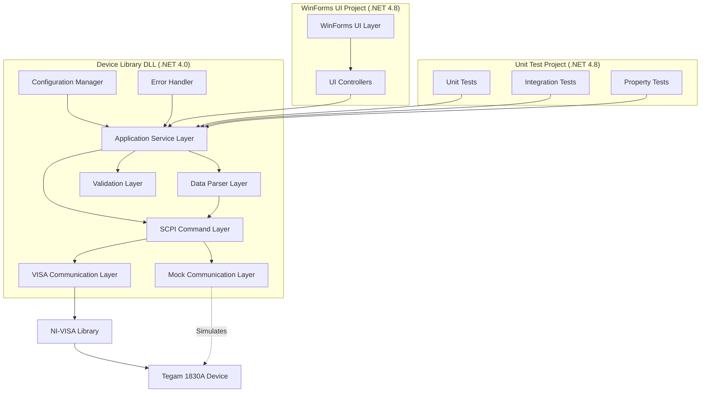
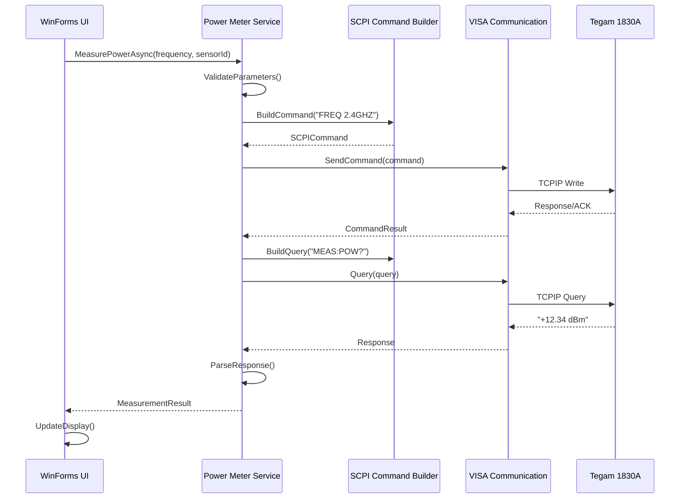

# Design Document: Tegam 1830A Control Application

## Overview

The Tegam 1830A Control Application is a comprehensive C# .NET solution that provides complete control over the Tegam 1830A RF/Microwave Power Meter. The solution is structured as three separate projects: a Device Library DLL (.NET Framework 4.0) containing all core device communication logic, a WinForms UI application (.NET Framework 4.8) that references the device library, and a Unit Test project (.NET Framework 4.8) for comprehensive testing. The device library communicates with the physical device via TCPIP using the NI-VISA library and implements the SCPI (Standard Commands for Programmable Instruments) protocol. The design follows the same layered architecture as the Siglent SDG6052X solution with clear separation between communication, command processing, data parsing, and user interface concerns. A mock communication component enables testing and development without physical hardware. The application supports all Tegam 1830A features including power measurement, frequency configuration, sensor management, calibration, and data logging.

## Architecture

The solution follows the same multi-project architecture as the Siglent SDG6052X with adaptations for the Tegam 1830A's measurement-focused functionality:



### Project Structure

**1. Tegam.1830A.DeviceLibrary (.NET Framework 4.0)**
- Core device communication classes
- SCPI command builder and response parser
- VISA communication manager (real and mock)
- Data models, validators, and service layer
- Compiled as a DLL for reuse
- No UI dependencies

**2. Tegam.1830A.WinFormsUI (.NET Framework 4.8)**
- WinForms application and forms
- UI controllers and event handlers
- References DeviceLibrary DLL
- Handles user interaction and display

**3. Tegam.1830A.Tests (.NET Framework 4.8)**
- Unit tests for all device library components
- Integration tests using mock communication
- Property-based tests
- References DeviceLibrary DLL

## Main Application Workflow



## Components and Interfaces

### Component 1: VISA Communication Manager

**Purpose**: Manages low-level TCPIP communication with the Tegam 1830A using NI-VISA library

**Project**: Tegam.1830A.DeviceLibrary

**Interface**:
```csharp
public interface IVisaCommunicationManager : IDisposable
{
    // Connection management
    bool Connect(string resourceName, int timeout = 5000);
    void Disconnect();
    bool IsConnected { get; }
    
    // Command execution
    CommandResult SendCommand(string command);
    string Query(string query);
    byte[] QueryBinary(string query);
    
    // Async operations
    Task<CommandResult> SendCommandAsync(string command);
    Task<string> QueryAsync(string query);
    
    // Device identification
    string GetDeviceIdentity();
    
    // Error handling
    event EventHandler<CommunicationErrorEventArgs> CommunicationError;
}
```

**Responsibilities**:
- Establish and maintain TCPIP connection via NI-VISA
- Send SCPI commands and receive responses
- Handle communication timeouts and errors
- Manage resource cleanup

**Implementations**:
- `VisaCommunicationManager`: Real hardware communication using NI-VISA
- `MockVisaCommunicationManager`: Simulated communication for testing

### Component 2: SCPI Command Builder

**Purpose**: Constructs valid SCPI commands from application-level parameters

**Project**: Tegam.1830A.DeviceLibrary

**Interface**:
```csharp
public interface IScpiCommandBuilder
{
    // Frequency configuration
    string BuildFrequencyCommand(double frequency, FrequencyUnit unit);
    string BuildFrequencyQueryCommand();
    
    // Power measurement
    string BuildMeasurePowerCommand();
    string BuildMeasurePowerQueryCommand();
    
    // Sensor management
    string BuildSelectSensorCommand(int sensorId);
    string BuildQuerySensorCommand();
    string BuildQueryAvailableSensorsCommand();
    
    // Calibration
    string BuildCalibrateCommand(CalibrationMode mode);
    string BuildQueryCalibrationStatusCommand();
    
    // Data logging
    string BuildStartLoggingCommand(string filename);
    string BuildStopLoggingCommand();
    string BuildQueryLoggingStatusCommand();
    
    // System commands
    string BuildSystemCommand(SystemCommandType type, params object[] parameters);
    string BuildQueryCommand(QueryType queryType);
}
```

**Responsibilities**:
- Generate syntactically correct SCPI commands
- Format numeric values according to SCPI standards
- Handle frequency unit conversions
- Validate command structure

### Component 3: SCPI Response Parser

**Purpose**: Parses SCPI responses into strongly-typed application objects

**Project**: Tegam.1830A.DeviceLibrary

**Interface**:
```csharp
public interface IScpiResponseParser
{
    // Parse basic responses
    bool ParseBooleanResponse(string response);
    double ParseNumericResponse(string response);
    string ParseStringResponse(string response);
    
    // Parse measurement responses
    PowerMeasurement ParsePowerMeasurement(string response);
    FrequencyResponse ParseFrequencyResponse(string response);
    
    // Parse sensor responses
    SensorInfo ParseSensorInfo(string response);
    List<SensorInfo> ParseAvailableSensors(string response);
    
    // Parse calibration responses
    CalibrationStatus ParseCalibrationStatus(string response);
    
    // Parse device info
    DeviceIdentity ParseIdentityResponse(string response);
    SystemStatus ParseSystemStatus(string response);
    
    // Error parsing
    DeviceError ParseErrorResponse(string response);
}
```

**Responsibilities**:
- Extract data from SCPI response strings
- Convert string values to appropriate types
- Handle unit conversions (dBm, W, mW, etc.)
- Parse error messages

### Component 4: Power Meter Service

**Purpose**: High-level application service coordinating device operations

**Project**: Tegam.1830A.DeviceLibrary

**Interface**:
```csharp
public interface IPowerMeterService
{
    // Connection
    Task<bool> ConnectAsync(string ipAddress);
    Task DisconnectAsync();
    bool IsConnected { get; }
    DeviceIdentity DeviceInfo { get; }
    
    // Frequency control
    Task<OperationResult> SetFrequencyAsync(double frequency, FrequencyUnit unit);
    Task<FrequencyResponse> GetFrequencyAsync();
    
    // Power measurement
    Task<PowerMeasurement> MeasurePowerAsync();
    Task<PowerMeasurement> MeasurePowerAsync(double frequency, FrequencyUnit unit);
    Task<List<PowerMeasurement>> MeasureMultipleAsync(int count, int delayMs);
    
    // Sensor management
    Task<OperationResult> SelectSensorAsync(int sensorId);
    Task<SensorInfo> GetCurrentSensorAsync();
    Task<List<SensorInfo>> GetAvailableSensorsAsync();
    
    // Calibration
    Task<OperationResult> CalibrateAsync(CalibrationMode mode);
    Task<CalibrationStatus> GetCalibrationStatusAsync();
    
    // Data logging
    Task<OperationResult> StartLoggingAsync(string filename);
    Task<OperationResult> StopLoggingAsync();
    Task<bool> IsLoggingAsync();
    
    // System operations
    Task<SystemStatus> GetSystemStatusAsync();
    Task<OperationResult> ResetDeviceAsync();
    Task<List<DeviceError>> GetErrorQueueAsync();
    
    // Events
    event EventHandler<MeasurementEventArgs> MeasurementReceived;
    event EventHandler<DeviceErrorEventArgs> DeviceError;
    event EventHandler<ConnectionStateChangedEventArgs> ConnectionStateChanged;
}
```

**Responsibilities**:
- Coordinate between UI and lower layers
- Validate user input parameters
- Manage asynchronous operations
- Handle errors and raise events
- Cache device state when appropriate

### Component 5: Input Validator

**Purpose**: Validates user input against Tegam 1830A specifications

**Project**: Tegam.1830A.DeviceLibrary

**Interface**:
```csharp
public interface IInputValidator
{
    // Frequency validation
    ValidationResult ValidateFrequency(double frequency, FrequencyUnit unit);
    
    // Sensor validation
    ValidationResult ValidateSensorId(int sensorId);
    
    // Calibration validation
    ValidationResult ValidateCalibrationMode(CalibrationMode mode);
    
    // Logging validation
    ValidationResult ValidateFilename(string filename);
    
    // Measurement validation
    ValidationResult ValidateMeasurementCount(int count);
    ValidationResult ValidateMeasurementDelay(int delayMs);
}
```

**Responsibilities**:
- Enforce device specification limits
- Provide user-friendly validation messages
- Check parameter interdependencies
- Prevent invalid configurations


## Data Models

### Model 1: PowerMeasurement

```csharp
public class PowerMeasurement
{
    public double Value { get; set; }            // Power value
    public PowerUnit Unit { get; set; }          // dBm, W, mW, µW
    public double Frequency { get; set; }        // Hz
    public int SensorId { get; set; }            // Active sensor
    public DateTime Timestamp { get; set; }      // Measurement time
    public double Temperature { get; set; }      // Sensor temperature (°C)
    public bool IsValid { get; set; }            // Measurement validity
    public string Notes { get; set; }            // Optional notes
}

public enum PowerUnit
{
    dBm,
    W,
    mW,
    µW,
    dBW
}
```

**Validation Rules**:
- Value must be within sensor measurement range
- Frequency must be within device operating range
- SensorId must be valid and available
- Timestamp must be recent (within last 5 seconds)

### Model 2: FrequencyResponse

```csharp
public class FrequencyResponse
{
    public double Frequency { get; set; }        /

## Data Models

### Model 1: PowerMeasurement

```csharp
public class PowerMeasurement
{
    public double Value { get; set; }            // Power value
    public PowerUnit Unit { get; set; }          // dBm, W, mW, µW
    public double Frequency { get; set; }        // Hz
    public int SensorId { get; set; }
    public DateTime Timestamp { get; set; }
    public double Uncertainty { get; set; }      // Measurement uncertainty
    public bool IsValid { get; set; }
}

public enum PowerUnit
{
    dBm,
    W,
    mW,
    µW
}
```

**Validation Rules**:
- Value must be within sensor measurement range
- Frequency must be within device operating range
- SensorId must be valid and available
- Uncertainty must be non-negative

### Model 2: FrequencyResponse

```csharp
public class FrequencyResponse
{
    public double Frequency { get; set; }        // Hz
    public FrequencyUnit Unit { get; set; }
    public double MinFrequency { get; set; }
    public double MaxFrequency { get; set; }
}

public enum FrequencyUnit
{
    Hz,
    kHz,
    MHz,
    GHz
}
```

### Model 3: SensorInfo

```csharp
public class SensorInfo
{
    public int SensorId { get; set; }
    public string SensorName { get; set; }
    public string SensorType { get; set; }
    public double MinFrequency { get; set; }     // Hz
    public double MaxFrequency { get; set; }     // Hz
    public double MinPower { get; set; }         // dBm
    public double MaxPower { get; set; }         // dBm
    public double Accuracy { get; set; }         // Percent
    public DateTime LastCalibration { get; set; }
    public bool IsActive { get; set; }
}
```

### Model 4: CalibrationStatus

```csharp
public class CalibrationStatus
{
    public bool IsCalibrated { get; set; }
    public DateTime LastCalibrationDate { get; set; }
    public DateTime NextCalibrationDue { get; set; }
    public CalibrationMode LastCalibrationMode { get; set; }
    public string CalibrationReference { get; set; }
}

public enum CalibrationMode
{
    Internal,
    External,
    Reference
}
```

### Model 5: DeviceIdentity

```csharp
public class DeviceIdentity
{
    public string Manufacturer { get; set; }     // "Tegam"
    public string Model { get; set; }            // "1830A"
    public string SerialNumber { get; set; }
    public string FirmwareVersion { get; set; }
}
```

### Model 6: OperationResult

```csharp
public class OperationResult
{
    public bool Success { get; set; }
    public string Message { get; set; }
    public DeviceError Error { get; set; }
    public DateTime Timestamp { get; set; }
    
    public static OperationResult Successful(string message = "Operation completed successfully")
    {
        return new OperationResult 
        { 
            Success = true, 
            Message = message,
            Timestamp = DateTime.Now
        };
    }
    
    public static OperationResult Failed(string message, DeviceError error = null)
    {
        return new OperationResult 
        { 
            Success = false, 
            Message = message,
            Error = error,
            Timestamp = DateTime.Now
        };
    }
}
```

### Model 7: CommandResult

```csharp
public class CommandResult
{
    public bool Success { get; set; }
    public string Response { get; set; }
    public byte[] BinaryData { get; set; }
    public Exception Exception { get; set; }
    public int ExecutionTimeMs { get; set; }
}
```

### Model 8: ValidationResult

```csharp
public class ValidationResult
{
    public bool IsValid { get; set; }
    public string ErrorMessage { get; set; }
    
    public static ValidationResult Valid() => new ValidationResult { IsValid = true };
    public static ValidationResult Invalid(string message) => new ValidationResult { IsValid = false, ErrorMessage = message };
}
```

### Model 9: DeviceError

```csharp
public class DeviceError
{
    public int Code { get; set; }
    public string Message { get; set; }
    public DateTime Timestamp { get; set; }
    public string Source { get; set; }
}
```

### Model 10: SystemStatus

```csharp
public class SystemStatus
{
    public bool IsReady { get; set; }
    public bool IsCalibrating { get; set; }
    public bool IsLogging { get; set; }
    public int ActiveSensorId { get; set; }
    public double CurrentFrequency { get; set; }
    public DateTime LastMeasurementTime { get; set; }
    public int ErrorCount { get; set; }
}
```

## Communication Simulation Strategy

### Purpose

The mock communication component enables development and testing without physical Tegam 1830A hardware. It simulates realistic device behavior including state management, SCPI response generation, and error conditions.

### Simulated Device State

The `MockVisaCommunicationManager` maintains complete simulated device state:

```csharp
public class SimulatedDeviceState
{
    public DeviceIdentity Identity { get; set; }
    public Dictionary<int, SensorInfo> Sensors { get; set; }
    public int ActiveSensorId { get; set; }
    public double CurrentFrequency { get; set; }
    public CalibrationStatus CalibrationStatus { get; set; }
    public Queue<DeviceError> ErrorQueue { get; set; }
    public bool IsLogging { get; set; }
    public string LogFilename { get; set; }
    public SystemStatus SystemStatus { get; set; }
    public DateTime LastCommandTime { get; set; }
}
```

### SCPI Command Processing

The mock manager parses incoming SCPI commands and updates simulated state:

**Command Categories**:
1. **Frequency Commands**: `FREQ 2.4GHZ`, `FREQ?`
   - Parse frequency and unit
   - Validate against device range
   - Update simulated state

2. **Measurement Commands**: `MEAS:POW?`, `MEAS:POW`
   - Generate realistic power measurement
   - Include uncertainty calculation
   - Return formatted response

3. **Sensor Commands**: `SENS:SEL 1`, `SENS:LIST?`
   - Manage sensor selection
   - Return available sensors

4. **Calibration Commands**: `CAL:INT`, `CAL:STAT?`
   - Simulate calibration process
   - Update calibration status

5. **Logging Commands**: `LOG:START "filename"`, `LOG:STOP`
   - Manage data logging state

6. **System Commands**: `*RST`, `*IDN?`, `SYST:ERR?`
   - Reset state or return device info

### Response Generation

The mock manager generates realistic SCPI responses:

```csharp
private string GeneratePowerMeasurementResponse()
{
    var measurement = GenerateRealisticMeasurement();
    return $"+{measurement.Value:F2} {MapUnitToScpi(measurement.Unit)}";
}

private string GenerateIdentityResponse()
{
    return $"{_deviceState.Identity.Manufacturer}," +
           $"{_deviceState.Identity.Model}," +
           $"{_deviceState.Identity.SerialNumber}," +
           $"{_deviceState.Identity.FirmwareVersion}";
}

private PowerMeasurement GenerateRealisticMeasurement()
{
    // Generate measurement with realistic noise and uncertainty
    var basePower = -20.0; // dBm
    var noise = _random.NextDouble() * 0.5 - 0.25; // ±0.25 dB noise
    
    return new PowerMeasurement
    {
        Value = basePower + noise,
        Unit = PowerUnit.dBm,
        Frequency = _deviceState.CurrentFrequency,
        SensorId = _deviceState.ActiveSensorId,
        Timestamp = DateTime.Now,
        Uncertainty = 0.5,
        IsValid = true
    };
}
```

### Error Simulation

The mock manager can simulate various error conditions:

```csharp
public void SimulateError(int errorCode, string errorMessage)
{
    _errorQueue.Enqueue(new DeviceError 
    { 
        Code = errorCode, 
        Message = errorMessage,
        Timestamp = DateTime.Now
    });
}

public void SimulateConnectionLoss()
{
    _isConnected = false;
    RaiseCommunicationError("Connection lost");
}

public void SimulateInvalidSensor()
{
    SimulateError(-222, "Invalid sensor ID");
}
```

### Validation in Mock

The mock manager validates parameters against device specifications:

```csharp
private CommandResult ValidateAndProcessCommand(string command)
{
    var parsed = ParseScpiCommand(command);
    
    // Validate frequency range
    if (parsed.Frequency < 100e6 || parsed.Frequency > 40e9)
    {
        SimulateError(-222, "Frequency out of range");
        return CommandResult.Failed("Frequency out of range");
    }
    
    // Validate sensor
    if (!_deviceState.Sensors.ContainsKey(parsed.SensorId))
    {
        SimulateError(-222, "Invalid sensor ID");
        return CommandResult.Failed("Invalid sensor ID");
    }
    
    UpdateDeviceState(parsed);
    return CommandResult.Successful();
}
```

## Key Functions with Formal Specifications

### Function 1: ConnectAsync()

```csharp
public async Task<bool> ConnectAsync(string ipAddress)
```

**Preconditions:**
- `ipAddress` is non-null and non-empty
- `ipAddress` is a valid IPv4 address format
- NI-VISA runtime is installed on the system
- Device is powered on and accessible on the network

**Postconditions:**
- If successful: `IsConnected == true` and `DeviceInfo` is populated
- If failed: `IsConnected == false` and `ConnectionStateChanged` event is raised
- VISA session is established or exception is thrown
- Connection timeout is enforced (default 5000ms)

**Loop Invariants:** N/A

### Function 2: MeasurePowerAsync()

```csharp
public async Task<PowerMeasurement> MeasurePowerAsync()
```

**Preconditions:**
- Device is connected (`IsConnected == true`)
- A valid sensor is selected
- Frequency is set within device range
- Device is not currently calibrating

**Postconditions:**
- Returns `PowerMeasurement` with valid measurement data
- Measurement includes timestamp, frequency, sensor ID, and uncertainty
- `MeasurementReceived` event is raised
- If device returns error, `DeviceError` event is raised

**Loop Invariants:** N/A

### Function 3: SetFrequencyAsync()

```csharp
public async Task<OperationResult> SetFrequencyAsync(double frequency, FrequencyUnit unit)
```

**Preconditions:**
- `frequency` is positive and finite
- `unit` is a valid FrequencyUnit enum value
- Device is connected
- Frequency is within device operating range (100 MHz to 40 GHz)

**Postconditions:**
- Returns `OperationResult` with `Success == true` if command executed
- Device frequency is updated on success
- No state change on device if operation fails
- `DeviceError` event is raised if device returns error

**Loop Invariants:** N/A

### Function 4: BuildFrequencyCommand()

```csharp
public string BuildFrequencyCommand(double frequency, FrequencyUnit unit)
```

**Preconditions:**
- `frequency` is positive and finite
- `unit` is a valid FrequencyUnit enum value
- Numeric values are within valid range

**Postconditions:**
- Returns valid SCPI command string in format: "FREQ {value}{unit}"
- Command string is properly formatted with correct units
- Numeric values are formatted with appropriate precision
- Command length does not exceed SCPI maximum

**Loop Invariants:** N/A

### Function 5: SelectSensorAsync()

```csharp
public async Task<OperationResult> SelectSensorAsync(int sensorId)
```

**Preconditions:**
- `sensorId` is a valid positive integer
- Device is connected
- Sensor with given ID exists and is available

**Postconditions:**
- Returns `OperationResult` with `Success == true` if sensor selected
- Active sensor is updated on success
- `SystemStatus` reflects new active sensor
- `DeviceError` event is raised if sensor is invalid

**Loop Invariants:** N/A

### Function 6: CalibrateAsync()

```csharp
public async Task<OperationResult> CalibrateAsync(CalibrationMode mode)
```

**Preconditions:**
- Device is connected
- Device is not currently measuring or logging
- `mode` is a valid CalibrationMode enum value

**Postconditions:**
- Returns `OperationResult` with `Success == true` if calibration started
- `CalibrationStatus` is updated with new calibration date
- Device is unavailable for measurements during calibration
- `SystemStatus.IsCalibrating` is true during operation

**Loop Invariants:** N/A


## Correctness Properties

*A property is a characteristic or behavior that should hold true across all valid executions of a system—essentially, a formal statement about what the system should do. Properties serve as the bridge between human-readable specifications and machine-verifiable correctness guarantees.*

### Property 1: Connection Establishment

For any valid IPv4 address, when a connection is attempted, the Power_Meter_Service SHALL set IsConnected to true and raise a ConnectionStateChanged event if and only if the device identity verification succeeds.

**Validates: Requirements 1.1, 1.2, 1.3, 1.5**

### Property 2: Device Identity Verification

For any device identity response, if the response contains "Tegam 1830A", the Power_Meter_Service SHALL accept the connection; otherwise, it SHALL disconnect and set IsConnected to false.

**Validates: Requirements 1.3, 1.4**

### Property 3: Connection Failure Handling

For any failed connection attempt, the Power_Meter_Service SHALL set IsConnected to false and raise a ConnectionStateChanged event with error details.

**Validates: Requirements 1.6**

### Property 4: Resource Cleanup on Disconnect

For any established connection, when disconnection is requested, the VISA_Manager SHALL close the VISA session and release all resources such that subsequent connection attempts can succeed.

**Validates: Requirements 1.8**

### Property 5: Frequency Validation Range

For any frequency value, the Input_Validator SHALL accept frequencies between 100 kHz and 40 GHz and reject all frequencies outside this range.

**Validates: Requirements 2.1, 7.1**

### Property 6: Frequency Command Format

For any valid frequency value and unit, the SCPI_Command_Builder SHALL construct a command matching the format "FREQ {value} {unit}".

**Validates: Requirements 2.3**

### Property 7: Frequency Verification Round Trip

For any valid frequency set via SetFrequencyAsync, querying the device with GetFrequencyAsync SHALL return the same frequency value.

**Validates: Requirements 2.4, 2.8**

### Property 8: Sensor ID Validation

For any sensor ID, the Input_Validator SHALL accept IDs 1-4 and reject all other values.

**Validates: Requirements 4.1, 7.3**

### Property 9: Sensor Selection Command Format

For any valid sensor ID (1-4), the SCPI_Command_Builder SHALL construct a command matching the format "SENS:SEL {sensorId}".

**Validates: Requirements 4.2**

### Property 10: Sensor Selection State Update

For any valid sensor ID, when a sensor selection command succeeds, the Power_Meter_Service SHALL update the current sensor state such that GetCurrentSensorAsync returns the newly selected sensor.

**Validates: Requirements 4.4**

### Property 11: Power Measurement Parsing

For any valid power measurement response from the device, the SCPI_Response_Parser SHALL parse it into a PowerMeasurement object containing power value, unit, and timestamp.

**Validates: Requirements 3.2**

### Property 12: Measurement Event Raising

For any power measurement received, the Power_Meter_Service SHALL raise a MeasurementReceived event with the measurement data.

**Validates: Requirements 3.3**

### Property 13: Multiple Measurements Collection

For any request to collect N measurements with delay D milliseconds, the Power_Meter_Service SHALL collect exactly N measurements with approximately D milliseconds between each measurement.

**Validates: Requirements 3.4**

### Property 14: Calibration Mode Validation

For any calibration mode, the Input_Validator SHALL accept "Internal" and "External" and reject all other values.

**Validates: Requirements 5.1, 7.5**

### Property 15: Calibration Status Polling

For any calibration operation, the Power_Meter_Service SHALL poll the device for calibration status until completion and return the final calibration status.

**Validates: Requirements 5.4, 5.5**

### Property 16: Filename Validation

For any filename, the Input_Validator SHALL reject filenames containing invalid path characters and accept all valid filenames.

**Validates: Requirements 6.1, 7.6**

### Property 17: Data Logging Round Trip

For any measurement taken while logging is active, the measurement SHALL be appended to the log file such that reading the log file contains the measurement data.

**Validates: Requirements 6.4**

### Property 18: Logging State Consistency

For any logging operation, the Power_Meter_Service SHALL maintain consistent logging state such that IsLoggingAsync returns true while logging is active and false after logging is stopped.

**Validates: Requirements 6.6**

### Property 19: Error Response Parsing

For any error response from the device, the SCPI_Response_Parser SHALL parse it into a DeviceError object containing error code and message.

**Validates: Requirements 8.1**

### Property 20: Error Event Raising

For any parsed error, the Power_Meter_Service SHALL raise a DeviceError event with error details.

**Validates: Requirements 8.2**

### Property 21: Mock Communication Equivalence

For any command sent to the Mock_VISA_Manager, the response format SHALL match the expected format for that command type.

**Validates: Requirements 9.2**

### Property 22: Mock Frequency State Persistence

For any frequency set via the Mock_VISA_Manager, subsequent frequency queries SHALL return the same frequency value.

**Validates: Requirements 9.3**

### Property 23: Mock Sensor State Persistence

For any sensor selected via the Mock_VISA_Manager, subsequent sensor queries SHALL return the same sensor ID.

**Validates: Requirements 9.4**

### Property 24: Device Identity Parsing

For any device identity response, the SCPI_Response_Parser SHALL parse it into a DeviceIdentity object containing manufacturer, model, and serial number.

**Validates: Requirements 10.2**

### Property 25: System Status Parsing

For any system status response, the SCPI_Response_Parser SHALL parse it into a SystemStatus object containing all relevant status fields.

**Validates: Requirements 10.4**

### Property 26: Error Queue Retrieval

For any error queue query, the Power_Meter_Service SHALL retrieve all pending errors from the device and parse them into a list of DeviceError objects.

**Validates: Requirements 10.8**

### Component 6: Configuration Manager

**Purpose**: Manages application configuration and device settings persistence

**Project**: Tegam.1830A.DeviceLibrary

**Interface**:
```csharp
public interface IConfigurationManager
{
    // Connection settings
    string GetLastIpAddress();
    void SaveLastIpAddress(string ipAddress);
    int GetConnectionTimeout();
    
    // Measurement settings
    FrequencyUnit GetDefaultFrequencyUnit();
    void SaveDefaultFrequencyUnit(FrequencyUnit unit);
    PowerUnit GetDefaultPowerUnit();
    void SaveDefaultPowerUnit(PowerUnit unit);
    
    // Logging settings
    string GetDefaultLogPath();
    void SaveDefaultLogPath(string path);
    
    // Application settings
    T GetSetting<T>(string key, T defaultValue);
    void SaveSetting<T>(string key, T value);
}
```

**Responsibilities**:
- Load and save application configuration
- Persist user preferences
- Manage default values
- Handle configuration file I/O

### Component 7: Error Handler

**Purpose**: Centralized error handling and logging

**Project**: Tegam.1830A.DeviceLibrary

**Interface**:
```csharp
public interface IErrorHandler
{
    // Error logging
    void LogError(Exception exception, string context);
    void LogWarning(string message, string context);
    void LogInfo(string message);
    
    // Error recovery
    bool TryRecoverFromError(DeviceError error, out string recoveryAction);
    
    // Error reporting
    event EventHandler<ErrorEventArgs> ErrorOccurred;
    List<ErrorLogEntry> GetRecentErrors(int count);
}
```

**Responsibilities**:
- Log errors to file or event log
- Provide error recovery strategies
- Notify UI of critical errors
- Maintain error history

### Component 8: Mock Communication Manager

**Purpose**: Simulates Tegam 1830A device for testing and development

**Project**: Tegam.1830A.DeviceLibrary

**Implementation**:
```csharp
public class MockVisaCommunicationManager : IVisaCommunicationManager
{
    private SimulatedDeviceState _deviceState;
    private bool _isConnected;
    
    // Simulates device responses based on commands
    public string Query(string query)
    {
        // Parse query and return simulated response
        // Example: "MEAS:POW?" returns simulated power reading
    }
    
    public CommandResult SendCommand(string command)
    {
        // Update simulated device state
        // Example: "FREQ 2.4GHZ" updates frequency state
    }
}
```

**Responsibilities**:
- Simulate realistic device responses
- Maintain simulated device state
- Support all SCPI commands
- Enable offline development and testing

## Data Models

### PowerMeasurement
```csharp
public class PowerMeasurement
{
    public double Value { get; set; }
    public PowerUnit Unit { get; set; }
    public DateTime Timestamp { get; set; }
    public double Frequency { get; set; }
    public FrequencyUnit FrequencyUnit { get; set; }
    public int SensorId { get; set; }
    public MeasurementStatus Status { get; set; }
    
    // Conversion methods
    public double ToDbm();
    public double ToWatts();
    public double ToMilliwatts();
}
```

### FrequencyResponse
```csharp
public class FrequencyResponse
{
    public double Value { get; set; }
    public FrequencyUnit Unit { get; set; }
    public bool IsValid { get; set; }
    
    // Conversion methods
    public double ToHertz();
    public double ToMegahertz();
    public double ToGigahertz();
}
```

### SensorInfo
```csharp
public class SensorInfo
{
    public int SensorId { get; set; }
    public string Model { get; set; }
    public string SerialNumber { get; set; }
    public double MinFrequency { get; set; }
    public double MaxFrequency { get; set; }
    public double MinPower { get; set; }
    public double MaxPower { get; set; }
    public FrequencyUnit FrequencyUnit { get; set; }
    public PowerUnit PowerUnit { get; set; }
    public bool IsConnected { get; set; }
    public DateTime LastCalibrationDate { get; set; }
}
```

### CalibrationStatus
```csharp
public class CalibrationStatus
{
    public bool IsCalibrated { get; set; }
    public DateTime CalibrationDate { get; set; }
    public CalibrationMode Mode { get; set; }
    public double CalibrationFactor { get; set; }
    public string CalibrationMessage { get; set; }
}
```

### DeviceIdentity
```csharp
public class DeviceIdentity
{
    public string Manufacturer { get; set; }
    public string Model { get; set; }
    public string SerialNumber { get; set; }
    public string FirmwareVersion { get; set; }
}
```

### SystemStatus
```csharp
public class SystemStatus
{
    public bool IsReady { get; set; }
    public bool HasErrors { get; set; }
    public int ErrorCount { get; set; }
    public double Temperature { get; set; }
    public bool IsLogging { get; set; }
    public string CurrentSensor { get; set; }
}
```

### OperationResult
```csharp
public class OperationResult
{
    public bool Success { get; set; }
    public string Message { get; set; }
    public DeviceError Error { get; set; }
    
    public static OperationResult Successful(string message = "");
    public static OperationResult Failed(string message, DeviceError error = null);
}
```

### DeviceError
```csharp
public class DeviceError
{
    public int ErrorCode { get; set; }
    public string ErrorMessage { get; set; }
    public ErrorSeverity Severity { get; set; }
    public DateTime Timestamp { get; set; }
}
```

### Enumerations
```csharp
public enum FrequencyUnit
{
    Hertz,
    Kilohertz,
    Megahertz,
    Gigahertz
}

public enum PowerUnit
{
    Dbm,
    Watts,
    Milliwatts
}

public enum CalibrationMode
{
    Zero,
    Reference,
    Full
}

public enum MeasurementStatus
{
    Valid,
    Overrange,
    Underrange,
    Error
}

public enum ErrorSeverity
{
    Info,
    Warning,
    Error,
    Critical
}
```

## UI Components

### MainForm
**Purpose**: Main application window with tabbed interface

**Features**:
- Connection panel (IP address, connect/disconnect buttons)
- Status bar showing connection state and device info
- Tab control with 5 tabs:
  - Power Measurement
  - Frequency Configuration
  - Sensor Management
  - Calibration
  - Data Logging

**Controller**: `MainFormController`

### PowerMeasurementPanel
**Purpose**: Display and control power measurements

**Features**:
- Large numeric display for current power reading
- Unit selector (dBm, W, mW)
- Single measurement button
- Continuous measurement mode
- Measurement history graph
- Export measurements button

**Controller**: `PowerMeasurementController`

### FrequencyConfigurationPanel
**Purpose**: Configure measurement frequency

**Features**:
- Frequency input field
- Unit selector (Hz, kHz, MHz, GHz)
- Set frequency button
- Current frequency display
- Frequency presets

**Controller**: `FrequencyConfigurationController`

### SensorManagementPanel
**Purpose**: Manage connected sensors

**Features**:
- List of available sensors
- Sensor details display (model, serial, frequency range, power range)
- Select sensor button
- Sensor calibration status
- Sensor connection indicator

**Controller**: `SensorManagementController`

### CalibrationPanel
**Purpose**: Perform sensor calibration

**Features**:
- Calibration mode selector (Zero, Reference, Full)
- Calibrate button
- Calibration status display
- Last calibration date
- Calibration instructions

**Controller**: `CalibrationController`

### DataLoggingPanel
**Purpose**: Configure and control data logging

**Features**:
- Log file path selector
- Start/stop logging buttons
- Logging status indicator
- Log interval configuration
- View log file button

**Controller**: `DataLoggingController`

## Error Handling Strategy

### Communication Errors
- **Timeout**: Retry up to 3 times with exponential backoff
- **Connection Lost**: Notify user, attempt reconnection
- **Invalid Response**: Log error, return error result to UI

### Device Errors
- **Overrange/Underrange**: Display warning, suggest corrective action
- **Calibration Required**: Prompt user to calibrate
- **Sensor Not Connected**: Display error, disable measurement functions

### Application Errors
- **Invalid Input**: Show validation message before sending to device
- **File I/O Errors**: Display error dialog, suggest alternative path
- **Configuration Errors**: Use default values, log warning

### Error Logging
- All errors logged to file: `%AppData%\Tegam1830A\Logs\error.log`
- Critical errors also logged to Windows Event Log
- Error log includes timestamp, context, stack trace

## Testing Strategy

### Unit Tests
- **SCPI Command Builder**: Verify correct command syntax for all operations
- **SCPI Response Parser**: Test parsing of all response formats
- **Input Validator**: Validate boundary conditions and invalid inputs
- **Mock Communication**: Verify simulated responses match real device

### Integration Tests
- **Service Layer**: Test complete workflows using mock communication
- **Error Handling**: Verify error recovery and reporting
- **Configuration**: Test settings persistence and retrieval

### Property-Based Tests
- **Frequency Conversion**: Verify unit conversions are reversible
- **Power Conversion**: Verify dBm/Watts/mW conversions are accurate
- **Command/Response Round-trip**: Verify parsing inverts building

### Manual Testing
- **Real Device**: Test with physical Tegam 1830A
- **UI Responsiveness**: Verify async operations don't block UI
- **Error Scenarios**: Test with device disconnected, invalid inputs

## Technology Stack

### Device Library (.NET Framework 4.0)
- **Language**: C# 7.3
- **Framework**: .NET Framework 4.0
- **Dependencies**:
  - NI-VISA .NET library (for hardware communication)
  - System.Configuration (for app settings)
  - No async/await (not available in .NET 4.0)

### WinForms UI (.NET Framework 4.8)
- **Language**: C# 7.3
- **Framework**: .NET Framework 4.8
- **UI Framework**: Windows Forms
- **Dependencies**:
  - Microsoft.Extensions.DependencyInjection 7.0.0 (for IoC container)
  - Reference to Tegam.1830A.DeviceLibrary.dll
  - System.Threading.Tasks (for async UI operations)

### Unit Tests (.NET Framework 4.8)
- **Language**: C# 7.3
- **Framework**: .NET Framework 4.8
- **Test Framework**: NUnit 3.13.3
- **Mocking**: Moq 4.18.4
- **Property Testing**: FsCheck 2.16.5, FsCheck.NUnit 2.16.5
- **Test Runner**: NUnit3TestAdapter 4.5.0

## Dependencies and Libraries

### NI-VISA
- **Purpose**: Hardware communication with TCPIP devices
- **Version**: Latest compatible with .NET Framework 4.0
- **Installation**: Requires NI-VISA Runtime installation on target machine
- **License**: Free runtime, included with National Instruments drivers

### Microsoft.Extensions.DependencyInjection
- **Purpose**: Dependency injection container for UI project
- **Version**: 7.0.0
- **Usage**: Register and resolve services, controllers, and forms

### NUnit and Testing Libraries
- **Purpose**: Unit testing, integration testing, property-based testing
- **Versions**: NUnit 3.13.3, Moq 4.18.4, FsCheck 2.16.5
- **Usage**: Development and CI/CD only, not deployed with application

## Deployment Considerations

### Prerequisites
- Windows 7 or later (32-bit or 64-bit)
- .NET Framework 4.8 Runtime
- NI-VISA Runtime (for hardware communication)
- Network connectivity to Tegam 1830A device

### Deployment Package
- `Tegam.1830A.WinFormsUI.exe` (main application)
- `Tegam.1830A.DeviceLibrary.dll` (device library)
- `Microsoft.Extensions.DependencyInjection.dll` (dependency)
- `Microsoft.Extensions.DependencyInjection.Abstractions.dll` (dependency)
- `app.config` (application configuration)
- `README.md` (user documentation)

### Installation
- Copy all files to installation directory (e.g., `C:\Program Files\Tegam1830A\`)
- Ensure NI-VISA Runtime is installed
- Create desktop shortcut to `Tegam.1830A.WinFormsUI.exe`
- No registry modifications required

### Configuration
- Default settings stored in `app.config`
- User settings stored in `%AppData%\Tegam1830A\settings.xml`
- Logs stored in `%AppData%\Tegam1830A\Logs\`

## Design Patterns

### Dependency Injection
- Services registered in `Program.cs` using `ServiceCollection`
- Constructor injection for all dependencies
- Promotes testability and loose coupling

### Repository Pattern
- `IVisaCommunicationManager` abstracts hardware communication
- Enables swapping between real and mock implementations
- Simplifies testing

### Service Layer Pattern
- `IPowerMeterService` provides high-level API
- Coordinates between UI and lower layers
- Encapsulates business logic

### Builder Pattern
- `IScpiCommandBuilder` constructs complex SCPI commands
- Separates command construction from execution
- Ensures command validity

### Observer Pattern
- Events for connection state changes, measurements, errors
- Decouples service layer from UI
- Enables reactive UI updates

## Concurrency Considerations

### Device Library (.NET 4.0)
- **No async/await**: .NET 4.0 doesn't support async/await
- **Synchronous methods only**: All methods are blocking
- **Thread safety**: Not thread-safe, single-threaded access expected

### WinForms UI (.NET 4.8)
- **Async wrappers**: UI wraps synchronous calls in `Task.Run()`
- **UI thread marshaling**: Use `Invoke()` for cross-thread UI updates
- **Responsive UI**: Long operations run on background threads
- **Example**:
```csharp
private async void btnMeasure_Click(object sender, EventArgs e)
{
    var result = await Task.Run(() => _powerMeterService.MeasurePower());
    UpdateDisplay(result);
}
```

## Security Considerations

### Network Communication
- TCPIP communication is unencrypted (SCPI protocol limitation)
- Recommend isolated network or VPN for sensitive environments
- No authentication required by Tegam 1830A device

### Input Validation
- All user inputs validated before sending to device
- Prevents command injection attacks
- Protects device from invalid configurations

### File System Access
- Log files written to user's AppData directory
- No elevated privileges required
- Configuration files use standard XML format

## Future Enhancements

### Potential Features
- Remote control via REST API
- Database storage for measurement history
- Advanced graphing and analysis tools
- Multi-device support (control multiple power meters)
- Automated test sequences
- Export to Excel/CSV formats

### Architecture Improvements
- Migrate Device Library to .NET Standard 2.0 for broader compatibility
- Add async/await support when .NET 4.0 support is no longer required
- Implement CQRS pattern for complex measurement workflows
- Add event sourcing for measurement history

## Conclusion

This design provides a robust, maintainable architecture for controlling the Tegam 1830A RF/Microwave Power Meter. The separation between Device Library and UI enables reuse and testing, while the layered architecture ensures clear separation of concerns. The mock communication component facilitates development and testing without physical hardware. The design follows established patterns from the Siglent SDG6052X solution while adapting to the measurement-focused nature of the Tegam 1830A device.
**Responsibilities**:
- Coordinate between UI and lower layers
- Validate user input parameters
- Manage asynchronous operations
- Handle errors and raise events
- Cache device state when appropriate

### Component 5: Input Validator

**Purpose**: Validates user input against Tegam 1830A specifications

**Project**: Tegam.1830A.DeviceLibrary

**Interface**:
```csharp
public interface IInputValidator
{
    // Frequency validation
    ValidationResult ValidateFrequency(double frequency, FrequencyUnit unit);
    
    // Sensor validation
    ValidationResult ValidateSensorId(int sensorId);
    
    // Calibration validation
    ValidationResult ValidateCalibrationMode(CalibrationMode mode);
    
    // Logging validation
    ValidationResult ValidateFilename(string filename);
    
    // Measurement validation
    ValidationResult ValidateMeasurementCount(int count);
    ValidationResult ValidateMeasurementDelay(int delayMs);
}
```

**Responsibilities**:
- Enforce device specification limits
- Provide user-friendly validation messages
- Check parameter interdependencies
- Prevent invalid configurations

### Component 6: Configuration Manager

**Purpose**: Manages application configuration and device settings persistence

**Project**: Tegam.1830A.DeviceLibrary

**Interface**:
```csharp
public interface IConfigurationManager
{
    // Connection settings
    string GetLastIpAddress();
    void SaveLastIpAddress(string ipAddress);
    int GetConnectionTimeout();
    
    // Measurement settings
    FrequencyUnit GetDefaultFrequencyUnit();
    void SaveDefaultFrequencyUnit(FrequencyUnit unit);
    PowerUnit GetDefaultPowerUnit();
    void SaveDefaultPowerUnit(PowerUnit unit);
    
    // Logging settings
    string GetDefaultLogPath();
    void SaveDefaultLogPath(string path);
    
    // Application settings
    T GetSetting<T>(string key, T defaultValue);
    void SaveSetting<T>(string key, T value);
}
```

**Responsibilities**:
- Load and save application configuration
- Persist user preferences
- Manage default values
- Handle configuration file I/O

### Component 7: Error Handler

**Purpose**: Centralized error handling and logging

**Project**: Tegam.1830A.DeviceLibrary

**Interface**:
```csharp
public interface IErrorHandler
{
    // Error logging
    void LogError(Exception exception, string context);
    void LogWarning(string message, string context);
    void LogInfo(string message);
    
    // Error recovery
    bool TryRecoverFromError(DeviceError error, out string recoveryAction);
    
    // Error reporting
    event EventHandler<ErrorEventArgs> ErrorOccurred;
    List<ErrorLogEntry> GetRecentErrors(int count);
}
```

**Responsibilities**:
- Log errors to file or event log
- Provide error recovery strategies
- Notify UI of critical errors
- Maintain error history

### Component 8: Mock Communication Manager

**Purpose**: Simulates Tegam 1830A device for testing and development

**Project**: Tegam.1830A.DeviceLibrary

**Implementation**:
```csharp
public class MockVisaCommunicationManager : IVisaCommunicationManager
{
    private SimulatedDeviceState _deviceState;
    private bool _isConnected;
    
    // Simulates device responses based on commands
    public string Query(string query)
    {
        // Parse query and return simulated response
        // Example: "MEAS:POW?" returns simulated power reading
    }
    
    public CommandResult SendCommand(string command)
    {
        // Update simulated device state
        // Example: "FREQ 2.4GHZ" updates frequency state
    }
}
```

**Responsibilities**:
- Simulate realistic device responses
- Maintain simulated device state
- Support all SCPI commands
- Enable offline development and testing

## Data Models

### PowerMeasurement
```csharp
public class PowerMeasurement
{
    public double Value { get; set; }
    public PowerUnit Unit { get; set; }
    public DateTime Timestamp { get; set; }
    public double Frequency { get; set; }
    public FrequencyUnit FrequencyUnit { get; set; }
    public int SensorId { get; set; }
    public MeasurementStatus Status { get; set; }
    
    // Conversion methods
    public double ToDbm();
    public double ToWatts();
    public double ToMilliwatts();
}
```

### FrequencyResponse
```csharp
public class FrequencyResponse
{
    public double Value { get; set; }
    public FrequencyUnit Unit { get; set; }
    public bool IsValid { get; set; }
    
    // Conversion methods
    public double ToHertz();
    public double ToMegahertz();
    public double ToGigahertz();
}
```

### SensorInfo
```csharp
public class SensorInfo
{
    public int SensorId { get; set; }
    public string Model { get; set; }
    public string SerialNumber { get; set; }
    public double MinFrequency { get; set; }
    public double MaxFrequency { get; set; }
    public double MinPower { get; set; }
    public double MaxPower { get; set; }
    public FrequencyUnit FrequencyUnit { get; set; }
    public PowerUnit PowerUnit { get; set; }
    public bool IsConnected { get; set; }
    public DateTime LastCalibrationDate { get; set; }
}
```

### CalibrationStatus
```csharp
public class CalibrationStatus
{
    public bool IsCalibrated { get; set; }
    public DateTime CalibrationDate { get; set; }
    public CalibrationMode Mode { get; set; }
    public double CalibrationFactor { get; set; }
    public string CalibrationMessage { get; set; }
}
```

### DeviceIdentity
```csharp
public class DeviceIdentity
{
    public string Manufacturer { get; set; }
    public string Model { get; set; }
    public string SerialNumber { get; set; }
    public string FirmwareVersion { get; set; }
}
```

### SystemStatus
```csharp
public class SystemStatus
{
    public bool IsReady { get; set; }
    public bool HasErrors { get; set; }
    public int ErrorCount { get; set; }
    public double Temperature { get; set; }
    public bool IsLogging { get; set; }
    public string CurrentSensor { get; set; }
}
```

### OperationResult
```csharp
public class OperationResult
{
    public bool Success { get; set; }
    public string Message { get; set; }
    public DeviceError Error { get; set; }
    
    public static OperationResult Successful(string message = "");
    public static OperationResult Failed(string message, DeviceError error = null);
}
```

### DeviceError
```csharp
public class DeviceError
{
    public int ErrorCode { get; set; }
    public string ErrorMessage { get; set; }
    public ErrorSeverity Severity { get; set; }
    public DateTime Timestamp { get; set; }
}
```

### Enumerations
```csharp
public enum FrequencyUnit
{
    Hertz,
    Kilohertz,
    Megahertz,
    Gigahertz
}

public enum PowerUnit
{
    Dbm,
    Watts,
    Milliwatts
}

public enum CalibrationMode
{
    Zero,
    Reference,
    Full
}

public enum MeasurementStatus
{
    Valid,
    Overrange,
    Underrange,
    Error
}

public enum ErrorSeverity
{
    Info,
    Warning,
    Error,
    Critical
}
```

## UI Components

### MainForm
**Purpose**: Main application window with tabbed interface

**Features**:
- Connection panel (IP address, connect/disconnect buttons)
- Status bar showing connection state and device info
- Tab control with 5 tabs:
  - Power Measurement
  - Frequency Configuration
  - Sensor Management
  - Calibration
  - Data Logging

**Controller**: `MainFormController`

### PowerMeasurementPanel
**Purpose**: Display and control power measurements

**Features**:
- Large numeric display for current power reading
- Unit selector (dBm, W, mW)
- Single measurement button
- Continuous measurement mode
- Measurement history graph
- Export measurements button

**Controller**: `PowerMeasurementController`

### FrequencyConfigurationPanel
**Purpose**: Configure measurement frequency

**Features**:
- Frequency input field
- Unit selector (Hz, kHz, MHz, GHz)
- Set frequency button
- Current frequency display
- Frequency presets

**Controller**: `FrequencyConfigurationController`

### SensorManagementPanel
**Purpose**: Manage connected sensors

**Features**:
- List of available sensors
- Sensor details display (model, serial, frequency range, power range)
- Select sensor button
- Sensor calibration status
- Sensor connection indicator

**Controller**: `SensorManagementController`

### CalibrationPanel
**Purpose**: Perform sensor calibration

**Features**:
- Calibration mode selector (Zero, Reference, Full)
- Calibrate button
- Calibration status display
- Last calibration date
- Calibration instructions

**Controller**: `CalibrationController`

### DataLoggingPanel
**Purpose**: Configure and control data logging

**Features**:
- Log file path selector
- Start/stop logging buttons
- Logging status indicator
- Log interval configuration
- View log file button

**Controller**: `DataLoggingController`

## Error Handling Strategy

### Communication Errors
- **Timeout**: Retry up to 3 times with exponential backoff
- **Connection Lost**: Notify user, attempt reconnection
- **Invalid Response**: Log error, return error result to UI

### Device Errors
- **Overrange/Underrange**: Display warning, suggest corrective action
- **Calibration Required**: Prompt user to calibrate
- **Sensor Not Connected**: Display error, disable measurement functions

### Application Errors
- **Invalid Input**: Show validation message before sending to device
- **File I/O Errors**: Display error dialog, suggest alternative path
- **Configuration Errors**: Use default values, log warning

### Error Logging
- All errors logged to file: `%AppData%\Tegam1830A\Logs\error.log`
- Critical errors also logged to Windows Event Log
- Error log includes timestamp, context, stack trace

## Testing Strategy

### Unit Tests
- **SCPI Command Builder**: Verify correct command syntax for all operations
- **SCPI Response Parser**: Test parsing of all response formats
- **Input Validator**: Validate boundary conditions and invalid inputs
- **Mock Communication**: Verify simulated responses match real device

### Integration Tests
- **Service Layer**: Test complete workflows using mock communication
- **Error Handling**: Verify error recovery and reporting
- **Configuration**: Test settings persistence and retrieval

### Property-Based Tests
- **Frequency Conversion**: Verify unit conversions are reversible
- **Power Conversion**: Verify dBm/Watts/mW conversions are accurate
- **Command/Response Round-trip**: Verify parsing inverts building

### Manual Testing
- **Real Device**: Test with physical Tegam 1830A
- **UI Responsiveness**: Verify async operations don't block UI
- **Error Scenarios**: Test with device disconnected, invalid inputs

## Technology Stack

### Device Library (.NET Framework 4.0)
- **Language**: C# 7.3
- **Framework**: .NET Framework 4.0
- **Dependencies**:
  - NI-VISA .NET library (for hardware communication)
  - System.Configuration (for app settings)
  - No async/await (not available in .NET 4.0)

### WinForms UI (.NET Framework 4.8)
- **Language**: C# 7.3
- **Framework**: .NET Framework 4.8
- **UI Framework**: Windows Forms
- **Dependencies**:
  - Microsoft.Extensions.DependencyInjection 7.0.0 (for IoC container)
  - Reference to Tegam.1830A.DeviceLibrary.dll
  - System.Threading.Tasks (for async UI operations)

### Unit Tests (.NET Framework 4.8)
- **Language**: C# 7.3
- **Framework**: .NET Framework 4.8
- **Test Framework**: NUnit 3.13.3
- **Mocking**: Moq 4.18.4
- **Property Testing**: FsCheck 2.16.5, FsCheck.NUnit 2.16.5
- **Test Runner**: NUnit3TestAdapter 4.5.0

## Dependencies and Libraries

### NI-VISA
- **Purpose**: Hardware communication with TCPIP devices
- **Version**: Latest compatible with .NET Framework 4.0
- **Installation**: Requires NI-VISA Runtime installation on target machine
- **License**: Free runtime, included with National Instruments drivers

### Microsoft.Extensions.DependencyInjection
- **Purpose**: Dependency injection container for UI project
- **Version**: 7.0.0
- **Usage**: Register and resolve services, controllers, and forms

### NUnit and Testing Libraries
- **Purpose**: Unit testing, integration testing, property-based testing
- **Versions**: NUnit 3.13.3, Moq 4.18.4, FsCheck 2.16.5
- **Usage**: Development and CI/CD only, not deployed with application

## Deployment Considerations

### Prerequisites
- Windows 7 or later (32-bit or 64-bit)
- .NET Framework 4.8 Runtime
- NI-VISA Runtime (for hardware communication)
- Network connectivity to Tegam 1830A device

### Deployment Package
- `Tegam.1830A.WinFormsUI.exe` (main application)
- `Tegam.1830A.DeviceLibrary.dll` (device library)
- `Microsoft.Extensions.DependencyInjection.dll` (dependency)
- `Microsoft.Extensions.DependencyInjection.Abstractions.dll` (dependency)
- `app.config` (application configuration)
- `README.md` (user documentation)

### Installation
- Copy all files to installation directory (e.g., `C:\Program Files\Tegam1830A\`)
- Ensure NI-VISA Runtime is installed
- Create desktop shortcut to `Tegam.1830A.WinFormsUI.exe`
- No registry modifications required

### Configuration
- Default settings stored in `app.config`
- User settings stored in `%AppData%\Tegam1830A\settings.xml`
- Logs stored in `%AppData%\Tegam1830A\Logs\`

## Design Patterns

### Dependency Injection
- Services registered in `Program.cs` using `ServiceCollection`
- Constructor injection for all dependencies
- Promotes testability and loose coupling

### Repository Pattern
- `IVisaCommunicationManager` abstracts hardware communication
- Enables swapping between real and mock implementations
- Simplifies testing

### Service Layer Pattern
- `IPowerMeterService` provides high-level API
- Coordinates between UI and lower layers
- Encapsulates business logic

### Builder Pattern
- `IScpiCommandBuilder` constructs complex SCPI commands
- Separates command construction from execution
- Ensures command validity

### Observer Pattern
- Events for connection state changes, measurements, errors
- Decouples service layer from UI
- Enables reactive UI updates

## Concurrency Considerations

### Device Library (.NET 4.0)
- **No async/await**: .NET 4.0 doesn't support async/await
- **Synchronous methods only**: All methods are blocking
- **Thread safety**: Not thread-safe, single-threaded access expected

### WinForms UI (.NET 4.8)
- **Async wrappers**: UI wraps synchronous calls in `Task.Run()`
- **UI thread marshaling**: Use `Invoke()` for cross-thread UI updates
- **Responsive UI**: Long operations run on background threads
- **Example**:
```csharp
private async void btnMeasure_Click(object sender, EventArgs e)
{
    var result = await Task.Run(() => _powerMeterService.MeasurePower());
    UpdateDisplay(result);
}
```

## Security Considerations

### Network Communication
- TCPIP communication is unencrypted (SCPI protocol limitation)
- Recommend isolated network or VPN for sensitive environments
- No authentication required by Tegam 1830A device

### Input Validation
- All user inputs validated before sending to device
- Prevents command injection attacks
- Protects device from invalid configurations

### File System Access
- Log files written to user's AppData directory
- No elevated privileges required
- Configuration files use standard XML format

## Future Enhancements

### Potential Features
- Remote control via REST API
- Database storage for measurement history
- Advanced graphing and analysis tools
- Multi-device support (control multiple power meters)
- Automated test sequences
- Export to Excel/CSV formats

### Architecture Improvements
- Migrate Device Library to .NET Standard 2.0 for broader compatibility
- Add async/await support when .NET 4.0 support is no longer required
- Implement CQRS pattern for complex measurement workflows
- Add event sourcing for measurement history

## Conclusion

This design provides a robust, maintainable architecture for controlling the Tegam 1830A RF/Microwave Power Meter. The separation between Device Library and UI enables reuse and testing, while the layered architecture ensures clear separation of concerns. The mock communication component facilitates development and testing without physical hardware. The design follows established patterns from the Siglent SDG6052X solution while adapting to the measurement-focused nature of the Tegam 1830A device.
